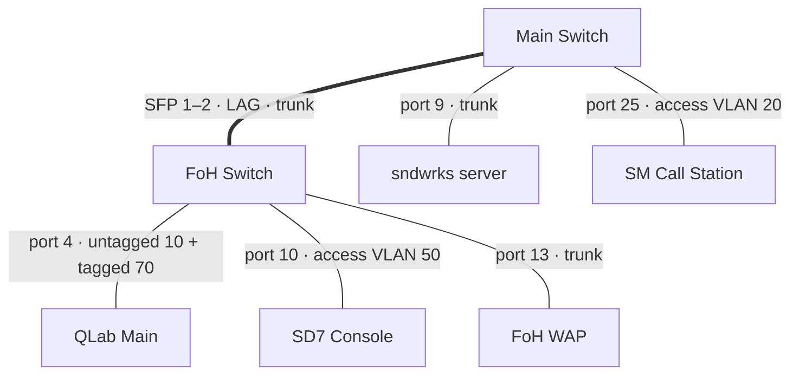
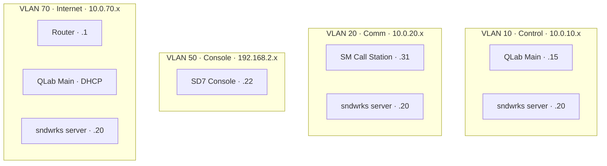

import { Icon, Aside } from '@astrojs/starlight/components';

A show network carries a lot of traffic: control, lighting data, digital audio, comm, etc. Oftentimes, the data traffic doesn't want to be intermingled.

There's two ways to achieve the isolation: physical networks or VLANs.

Physical networks are often easiest to configure, just use dumb switches and run a cable everywhere. This works well for small networks, but doesn't scale.

Virtual networks require more configuration, but the tradeoff is you don't have to have 10 separate network runs between locations.

That being said, there can be a cognitive overhead with managing the virtual networks as the configuration parameters increase quite a bit. The hardware to support VLANs increases the cost of a project as well.

This guide will reflect a larger, broadway-style network that leverages VLANs to simplify the physical infrastructure.

We like to represent networks like this in two ways:

- A **virtual layout** — what networks exist and who lives on each one.
- A **physical layout** — every switch port and what plugs into it.

<Aside type="note">
This is an example specification for a large show network. There are many ways to architect a show network.
</Aside>

## The VLAN plan
<Icon name="open-book" />

The first step is laying out the bones of your network. It's important to consider which traffic wants to be separate and which traffic can coexist.

Often, the separation of networks is dictated by priority. You may not want co-mingle critical comm traffic with the internet network as an extreme example.

VLANs are defined with an ID and a subnet. To reduce the amount of numbers, we like to do the vlan id the same as the third octet of the ip address. So, a VLAN ID of `30` would correspond to `10.0.30.x` or `192.168.30.x`.

It may be worth mentioning here that you'll likely want to choose addresses in the private IP range `192.168.0.0/16`, `172..16.0.0/12`, or `10.0.0.0/8`. These addresses are in [CIDR Notation](https://en.wikipedia.org/wiki/Classless_Inter-Domain_Routing).

A full plan for a musical looks something like this:

| VLAN | Name | Subnet | What's on it |
| --- | --- | --- | --- |
| 1 | Management | `10.0.1.x` | Switches, routers, WAPs — the network itself |
| 10 | Control | `10.0.10.x` | Show control: QLab, plugin hosts, processors, amps |
| 20 | Comm | `10.0.20.x` | Comm stations, beltpack antennas, call panels |
| 30 | Video | `10.0.30.x` | Video routers, PTZ cameras, recorders |
| 40 | KVM | `10.0.40.x` | KVM-over-IP transmitters and receivers |
| 50 | Console | `192.168.2.x` | The mixing console and its engines |
| 60 | RF | `10.0.60.x` | Wireless mic receivers, chargers, spectrum tools |
| 61 | RF Listen | `10.0.61.x` | Dante for the RF listen system |
| 70 | Internet | `10.0.70.x` | The one VLAN with a route to the outside world |
| 80 | AVB | link-local | AVB audio to the processors and amps |
| 90 | sACN | `10.0.90.x` | Lighting data to sound (cue lights, haze) |
| 100 | Haze Watch | `10.0.100.x` | Air-quality sensors |
| 110 | PSN | `10.0.110.x` | PosiStageNet position data |

VLAN 50 breaks the third-octet rule because the console ecosystem ships with its own fixed addressing scheme — it's easier to give the console its walled garden than to fight it. Every rule needs exactly one exception so you remember it's a rule.

<Aside type="note" icon="information">
Everything is a `/24` (`255.255.255.0`). Show networks often aren't big enough to need to issue more than 255 addresses on a single network.
</Aside>

## The virtual spreadsheet
<Icon name="open-book" />

The virtual layout sheet is the *logical* view: one block per VLAN, listing every device on that network and its IP.

- `.1` — the router (if this VLAN has one)
- `.2–.9` — network infrastructure
- `.11–.19` — control computers
- `.21` and up — devices, grouped in ranges (`.2x` racks, `.3x` stations, `.4x` amps…)
- `.101` and up — people's machines: designers, techs, production
- `.151–.200` — the DHCP pool, for wireless and visitors

This away an IP tells you what a device *does*, not just where it lives. `10.0.10.41` is an amp on Control. `10.0.20.103` is somebody's laptop on Comm.

Here's a trimmed block for VLAN 10:

| Name | IP | Notes |
| --- | --- | --- |
| **Control** | `10.0.10.x` | VLAN ID = 10, `255.255.255.0` |
| Router | `10.0.10.1` | Gateway |
| QLab Main | `10.0.10.15` | |
| sndwrks server | `10.0.10.20` | |
| Orch/Downfill amp | `10.0.10.41` | |
| Designer laptop | `10.0.10.101` | |
| DHCP | `10.0.10.151–200` | Wireless clients |

Notice the server appears in this block: it'll appear again in the Comm block at `10.0.20.20`, and Video at `10.0.30.20`. This way it has the same last octet for easy identification across networks. This a way to manage the overhead of having so many different IP addresses. 

## The physical spreadsheet
<Icon name="open-book" />

The physical layout sheet is the *port map*: one row per switch port.

| Column | Meaning |
| --- | --- |
| Switch | Which physical switch |
| Port | Which port on it |
| VLAN | The VLAN(s) on that port — or `Trunk` |
| Device | What plugs in |

This is where tagged and untagged happen, so it's worth being precise about the terms:

- **Untagged (access)** — the port belongs to exactly one VLAN. Frames arrive plain, and the switch files them into that VLAN. The device has no idea VLANs exist. This is most devices: a comm station, a console, an amp.
- **Tagged** — frames carry an 802.1Q header naming their VLAN, so one cable can carry several networks at once. The device on the end has to understand tags and be configured for them.
- **Trunk** — a port carrying many tagged VLANs. Switch-to-switch links, servers, and wireless access points are the usual trunk customers.

Every switch also reserves its **last copper port for VLAN 1**, untagged. You can always walk up with a laptop, plug into the management network, and fix whatever you just broke. It's often easy to click the wrong setting and lose connectivity to a switch on another part of the network.

## A working example
<Icon name="open-book" />

This example shows a very small network with two switches and four VLANs. 

| Switch | Port | VLAN | Device | Port type |
| --- | --- | --- | --- | --- |
| FoH | 4 | `10` + `70T` | QLab Main | Untagged 10, tagged 70 |
| FoH | 10 | `50` | SD7 Console | Access — one VLAN only |
| FoH | 13 | `Trunk` | FoH WAP | All VLANs tagged |
| FoH | SFP 1–2 | `Trunk` | LAG to Main | All VLANs tagged |
| Main | 9 | `Trunk` | sndwrks server | All VLANs tagged |
| Main | 25 | `20` | SM Call Station | Access — one VLAN only |
| Main | 24 | `1` | Management | The walk-up port |

Reading down the rows:

- The **SD7** and the **SM call station** are the simple case: access ports, one untagged VLAN each. The devices never see a tag.
- **QLab Main** is the mixed case: its show-control traffic rides VLAN 10 untagged (so the Mac's network stack needs no special config), and VLAN 70 arrives tagged on the same cable for the rare moments it needs the internet — a second, tagged interface configured in macOS.
- The **sndwrks server** and the **WAP** are pure trunks. The server needs a presence on every network it monitors; the WAP maps each SSID to a tagged VLAN.
- The **LAG** between switches is two SFP ports aggregated into one logical trunk for bandwidth and redundancy.

### The physical view

What the cabling actually looks like:

### The virtual view

The same five devices, redrawn as the networks see them.

The server shows up in three networks because its trunk port carries three tags. QLab shows up in two — one untagged, one tagged. The console shows up in exactly one, which is exactly how much of your network a console should be able to reach.

## Wrapping up
<Icon name="open-book" />

Hopefully, that was a helpful introduction into a way to setup a show control network. If you have any more questions, join our discord. The link is in the navbar to the right.