import { Icon } from '@astrojs/starlight/components';

We'll dive into the differences between TCP and UDP.

There are two major protocols in the transport layer of the [OSI Model](https://en.wikipedia.org/wiki/OSI_model): **TCP** and **UDP**. Nearly all show-control traffic (cue triggers, fader streams, OSC, PosiStageNet) rides on one of them.

The choice between the two changes how your show behaves when something goes wrong on the network.

## The Mail
<Icon name="open-book" />

A simple analogy is sending a letter.

**TCP is certified mail.** You hand the letter to the post office, they confirm they have it, and when it arrives the recipient signs for it. The signed receipt comes back to you. If the letter is lost somewhere along the way, the post office reissues it. There's more paperwork, it's a bit slower, but you *know* it landed.

**UDP is regular post.** You drop letters in the mailbox and walk away. Most of them arrive. Once in a while one doesn't, and you'll never find out which one. There's no signature, no receipt, no second attempt.

That's the whole intuition. TCP trades speed for certainty. UDP trades certainty for speed.

## In a show-control network
<Icon name="open-book" />

That trade-off lands differently depending on what kind of message you're sending.

**Use TCP when you must know it happened.** A single cue trigger from the stage manager's console to the server — `GO`, fire pyro, start a video — is one message that has to land. There's no follow-up packet coming along behind it carrying a fresher version. The few milliseconds of overhead from a handshake and an acknowledgement are nothing compared to the cost of a missed cue.

**Use UDP when the next value supersedes the last.** A fader streaming its position to a server thirty or sixty times a second is the textbook case. If one packet drops on the way, the next one is already in flight carrying a more recent value. The receiver just keeps up — it doesn't even notice. Trying to retransmit a stale fader value would be worse than useless: you'd hear it lag.

:::tip
OSC almost always runs over UDP for exactly this reason — it's typically used for high-rate streams like fader and encoder values. See [Using Code to Send OSC](/guides/using-code-to-send-osc/) for examples.
:::

## A little deeper
<Icon name="open-book" />

If you want to peek under the hood, the difference is really about what each protocol does *before* and *after* the data.

**TCP is a conversation.** Before any data flows, the two machines do a three-way handshake. The client sends `SYN` ("I'd like to talk"), the server sends back `SYN-ACK` ("heard you, ready"), and the client replies `ACK` ("great, let's go"). Only then does the actual data start moving.

Once the channel is open, every chunk of data is acknowledged. Lost chunks are detected and retransmitted. Chunks that arrive out of order are reassembled in order before they're handed to the application.

That reliability has a cost. The handshake adds a round trip before the first byte. Every packet adds a small amount of back-and-forth chatter. For a single cue this is invisible. For a continuous stream of fader values at 60 Hz, it's the difference between a console that feels live and one that feels glued down.

**UDP is a postcard.** No handshake. No acknowledgement. No retransmission. No reordering. The sender just emits packets and the receiver takes whatever shows up, in whatever order. That's the whole protocol — and that minimalism is exactly why it wins for real-time streams.

## Picking one
<Icon name="open-book" />

A short cheat sheet:

- Triggering something discrete that must happen exactly once → **TCP**
- Streaming a continuously updating value where freshness beats completeness → **UDP**
- OSC for cues, levels, encoders, position data → **UDP**, almost always
- A query and response, or a single command that must land → **TCP** is usually fine
