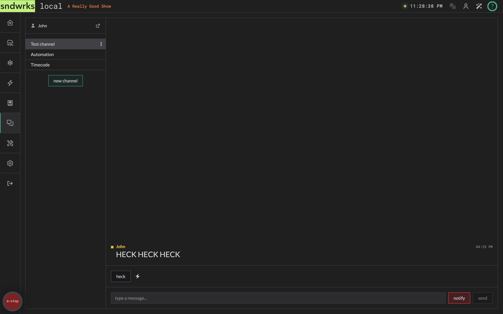
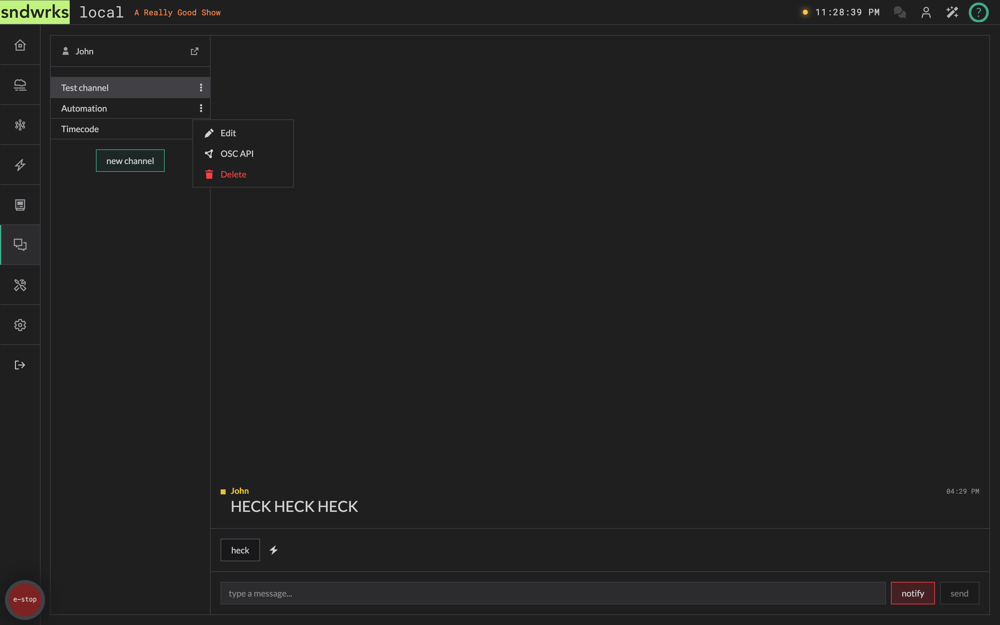
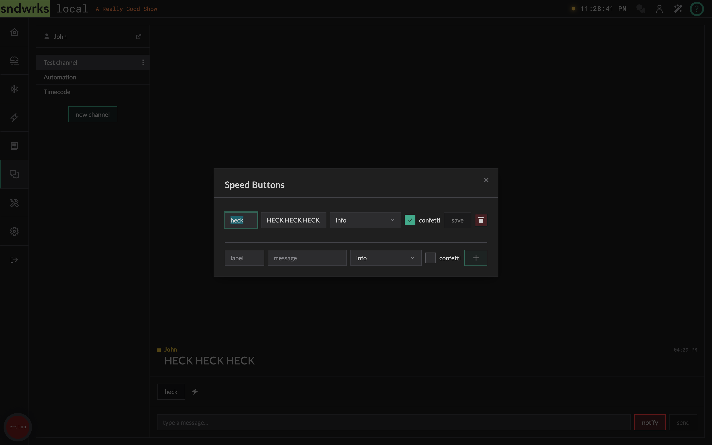
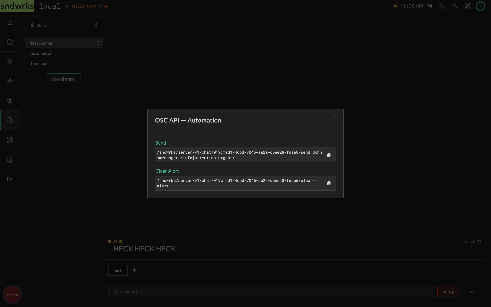

import { Icon, Aside } from '@astrojs/starlight/components';

A simple chat for the team running the show. It uses your [signed-in account](/products/sndwrks-local/software/users-and-permissions), so your name and avatar come along automatically.




## Channels
<Icon name="star" />

Conversations are organized into channels. Pick one from the channel list, or add a new channel.

To start a new one, click **new channel** at the bottom of the list and give it a name. If you don't have permission to create channels the button is still there, just greyed out. Hover it, and it'll tell you which permission you'd need so you can request it from the admin user.

Each channel row has a three-button **⋮** menu with:

- **Edit** — rename the channel.
- **OSC API** — the OSC addresses for this channel (more below).
- **Delete** — remove the channel.

Those entries only appear if you have the matching permission, so a shorter menu means someone gave you a narrower set of keys.



## Messages
<Icon name="star" />

Every message carries a priority: **info**, **attention**, or **urgent**. Urgent causes a notification to show on the browser regardless of if you're navigated to the chat page or not.

Sending a message that notifies the rest of the team is its own permission, separate from just posting in a channel. That means you can give someone a voice in chat without giving them the ability to set off everyone's browser.

### Speed buttons
<Icon name="star" />

Speed buttons are one-click canned messages: handy for the things you send every single show or everything is on fire and you don't have time to type a message.

Open the manage dialog next to the buttons to build them. Each one gets a **label** (what's on the button), a **message** (what actually gets sent), a **priority**, and optionally **confetti**, which is exactly what it sounds like.



### OSC API
<Icon name="star" />

Any channel can be driven from a console or another device over OSC.

One example we think is neat is sending a message when you swap from an actors main mic to a backup. This way the A2 can see if there's a swap that happened, and you have a record of when that happened. You could even send a [custom event](/reference/osc-api-v1/#chat) along with the chat message so you can search the event logs later to see when you swapped.

Open **⋮ → OSC API** on the channel to see its addresses:

```
/sndwrks/server/v1/chat/<channel-id>/send <from> <message> <info|attention|urgent>
/sndwrks/server/v1/chat/<channel-id>/clear-alert
```

The dialog fills in the real channel id for you, so you can copy the address straight into your console.



## Notifications
<Icon name="star" />

Notification preferences live in [Settings → Chat Notification Settings](/products/sndwrks-local/software/settings). They're saved to your account, so they follow you between browsers.

<Aside type="note">
Muting a channel is part of those preferences, so a channel you've muted stays quiet on every machine you sign in from.
</Aside>
