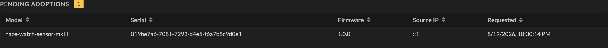
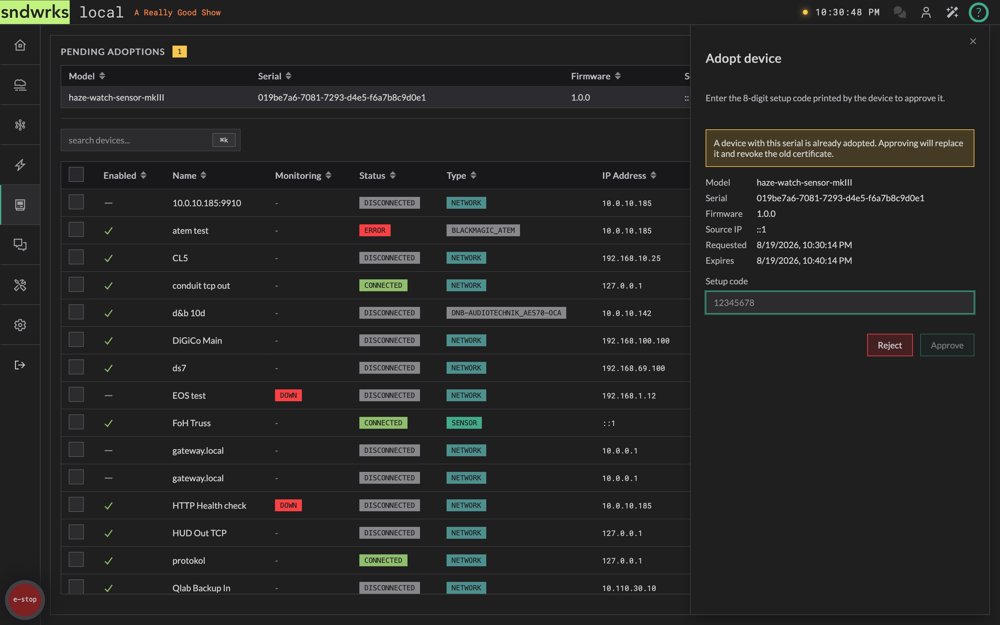

import { Steps, Icon, Aside } from '@astrojs/starlight/components';

sndwrks sensors don't get typed in like a console or an amplifier. They **adopt**: the device asks the server to take it on, you approve it with the code from the [cloud app](https://app.sndwrks.com), and from then on the two recognize each other on their own.

Once adopted, a device has its own identity on your server. Nothing is shared between devices.

## Adopt a device
<Icon name="star" />

<Steps>
1. **Plug it in.** Put the sensor on the show network and power it up. It'll find the server and ask to be adopted.
2. **Open Devices.** A **Pending adoptions** section appears at the top of the page with a count badge. It's only there when something is actually waiting.
3. **Find your device in the list.** Each row shows Model, Serial, Firmware, Source IP, and when it asked. If you're adopting a bunch of identical sensors, the serial is how you tell them apart.
4. **Click the row.** The **Adopt device** drawer opens with those details plus an expiry.
5. **Enter the setup code.** You'll find this in the [cloud app](https://app.sndwrks.com) in the system page.
6. **Approve.** The server issues the device its credentials and it joins your device list. **Reject** if you weren't expecting the request.
</Steps>

The pending section at the top of the Devices page (steps 2 and 3):

And the drawer that opens when you click a row (steps 4 through 6):

<Aside type="caution">
If a device with the same serial is already adopted, the drawer says so before you approve: continuing **replaces** the existing device and revokes its old credentials.
</Aside>

## Why the setup code
<Icon name="star" />

The code is what proves the device in front of you is the device asking to be adopted. Approving without it would mean anything that can reach the server could ask to join and eventually get a yes.

Because the code has to be typed by a person with physical access to the device and cloud permissions, adoption can't happen unattended, and something impersonating your sensor from elsewhere on the network can't complete the handshake. The device generates its own keys and never sends them anywhere.

This process is similar to ones used by other IoT devices. 

## Permissions
<Icon name="star" />

Adoption has its own [permissions](/products/sndwrks-local/software/users-and-permissions), separate from the rest of the Devices page: *view* the pending list, *approve*, and *reject*. Handy when the person plugging in the sensors isn't the person who should be deciding what joins the show.

Without the view permission the Pending adoptions section doesn't appear at all.
