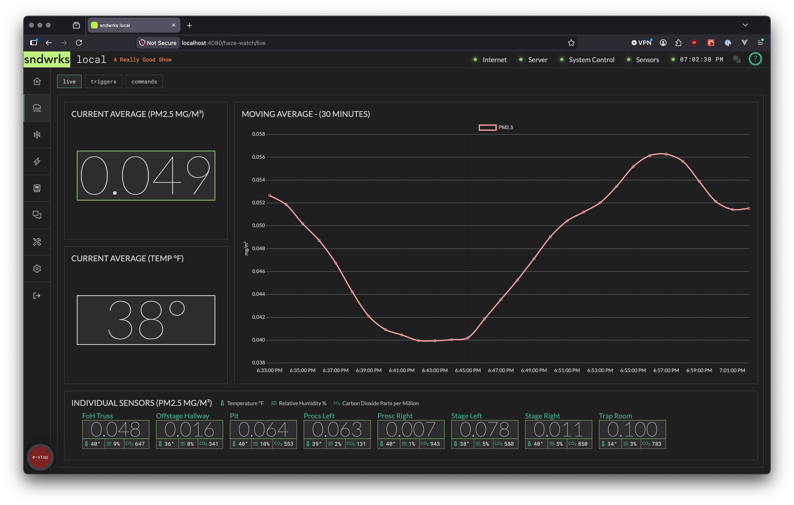

import { Steps, Icon, Aside } from '@astrojs/starlight/components';

Haze Watch reads particulate values, temperature, relative humidity, and CO₂ from your sensors, and allows for control schemes to be setup to keep your haze consistent. 

Triggers use commands to send out OSC messages based on a certain particulate level. This allows for you to implement control or even just send a message to something like [sndwrks hud](https://github.com/sndwrks/hud) when certain sensors reach a certain level.

## Setup Haze Watch Control
<Icon name="star" />

Use these quick steps to get control setup via Haze Watch:

<Steps>
1. Make sure your sensors are connected and you've labeled them in the **Devices** page.
2. Add the device you want to send the osc messages to in the **Devices** tab.
3. Create a new command in the **commands** tab in Haze Watch.
4. Enable it and fill out the various pieces of information and save it.
5. Create a new trigger in the **triggers** tab.
6. Enable it and fill out the fields. Add in the control you just created and the sensors you want to use to control this trigger.
7. Save it and wait for the trigger loop to evaluate its state. That's it! You've got control!
</Steps>

## Live
<Icon name="star" />

The live tab shows the current sensor status and historical trends.

### Current Average (PM2.5)
<Icon name="star" />

This is a 1 second windowed average of all the sensors PM2.5 particulate readings.

### Current Average (Temp)
<Icon name="star" />

This is a 1 second windowed average of all the sensors temperature readings.

### Moving Average
<Icon name="star" />

This graph shows the moving average of all the sensors PM2.5 readings every two minutes for the past 30 minutes. The moving average is helpful to show trends over time.

### Individual Sensors
<Icon name="star" />

Each sensor that has been connected to the server shows up here. This data is realtime and is updated with every reading received from each sensor.

## Triggers
<Icon name="star" />

Triggers combine sensors, commands and a trigger level to allow for messages to be sent out when levels reach a certain threshold. 

The triggers are evaluated every 10 seconds based on the selected sensors. So, if you have prosc left and prosc right selected (as an example), the trigger will evaluate those sensors moving averages every 10 seconds and decide which command messages should be fired.

If the sensor averages is below your trigger level, then the trigger will send out the attached commands `Below` message.

Upon E-Stop engage, all active triggers will tell the associated commands to send out the `E-Stop` message.

Triggers can be controlled with the [OSC API](/reference/osc-api-v1/#haze-watch-triggers).

<Aside type="tip" icon="pencil">
Are you about to hit that sultry dance number? Crank the haze up in advance! 

You can use the OSC API to send a message to the server to change the trigger level of a trigger to dynamically adjust the trigger.
</Aside>

### Trigger Level
<Icon name="star" />

The trigger level sets the value you want the above vs below messages to be fired.

For example, if you really like the look at `0.500`, you'd set that as your trigger level. Then when the haze level is below that, you'll send the below message likely increasing haze and when it's above that it'd send the above level which will send your *reduce the haze* or below command.

### Commands
<Icon name="star" />

This is a list of the commands attached to this trigger.

### Sensors
<Icon name="star" />

These are the sensors that this trigger uses to determine which command messages should be sent. It takes a moving average of the sensors in the list to determine that level.

<Aside type="note">
**Why do we use moving averages for triggering?**

The moving average helps smooth out the triggering so that we *know* which direction to send the commands. It also helps preventing flapping where a trigger goes above and below rapidly.
</Aside>

## Commands
<Icon name="star" />

The commands are the specific messages you want to send out from your triggers.

For example, you could have a command that controls your deck hazer and one for the truss hazer and tie that to your stage look trigger.

Or, you could have a "trap room is getting foggy" command that notifies a board op to tell someone backstage to open a door.

### OSC Destination
<Icon name="star" />

This is where the command should send it's messages to. Ideally, this device will be set as TCP osc, but UDP works as well since the command will get sent again in 10 seconds.

### Above Message
<Icon name="star" />

The above message gets sent when a trigger level is *above* what you desire. 

This command message would usually be something that *lowers* your haze level.

### Below Message
<Icon name="star" />

The below message gets sent when a trigger level is *below* what is set.

This message is usually used to *increase* the level of your haze.

### E Stop Message
<Icon name="star" />

This message gets send when the E-Stop is engaged. When the E-Stop is disengaged, Haze Watch immediately calculates what the current command message should be and sends that out (above/below).