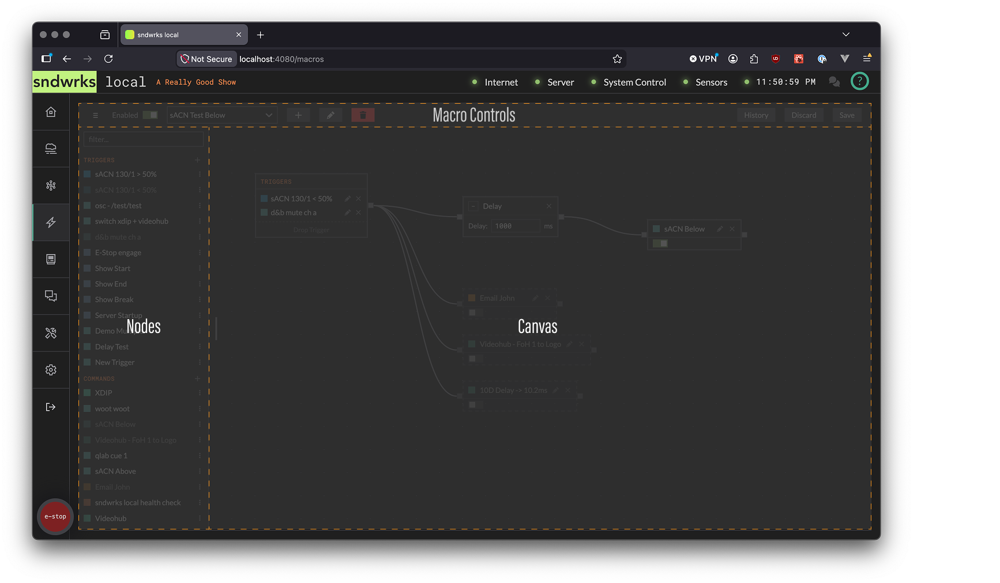
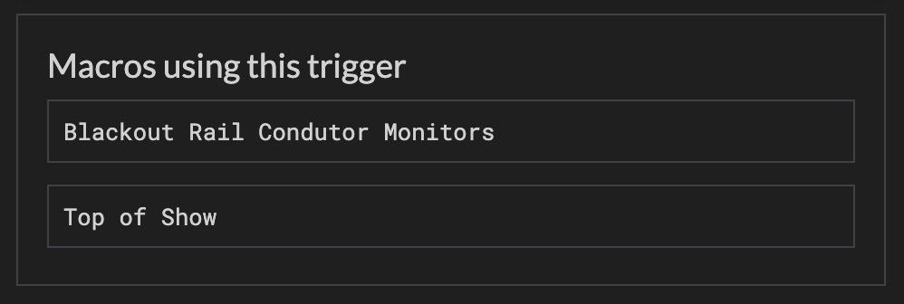

import { Card, Steps, Icon, Aside } from '@astrojs/starlight/components';

Macros are node-based composable actions.

They're very handy for creating complex controls easily. As an example, you could build a macro to send yourself an email, change a videohub crosspoint, and send an OSC message.

They consist of **triggers**, **commands**, and **transformers**. Triggers, for example an OSC message, fire the macro. Commands execute actions, like muting an OCA/AES70-capable amplifier. Transformers modify the macro execution with blocks like delay.

## Build a Macro
<Icon name="star" />

Let's make our first macro! 

<Steps>
1. Click the Plus `+` next to the macro dropdown.
2. Enter a name and change the debounce value is desired. Debounce is the time allowed before firing again.
3. Press `⏎` to save, or `esc` to discard, or click the buttons.
4. Now, if you don't have any triggers create one.
5. Drag the created trigger to the triggers node.
6. If you don't have a command, create one. (email is quick)
7. Drag the command onto the macro canvas.
8. Connect the trigger node to the command node.
9. Click `Save` in the top right corner.
</Steps>

## Macros
<Icon name="star" />

The macros page consists of 3 major sections: the macro controls (top), the nodes (side), the canvas (middle).

### Macro Controls Section
<Icon name="star" />

The controls allow for creation, deletion, editing, enabling, and selecting macros. The macros also store version history, so you can reset to an old state if you'd like.

### Nodes Section
<Icon name="star" />

The nodes section contains all the possible nodes that can be dropped into the canvas.

You can use the filter box to find something quickly, and the section can be resized.

### Canvas Section
<Icon name="star" />

The canvas section holds the selected macros nodes. It allows for visual editing of the function of the macro. It is drag and drop for the most part. 

## Triggers
<Icon name="star" />

Triggers initiate the macro. Multiple triggers can be added to a macro, and triggers can be reused.

Click the `+` in the sidebar by **Triggers** to add one. There are three dots to access various actions you can do to a trigger after you've created it.

Disabling a trigger will stop it from firing any macros. You can also change this value via the [OSC API](/reference/osc-api-v1/#enable-a-macro-trigger) 

When you are editing a trigger, you can see which macros have the trigger attached to them.

### Custom OSC Address
<Icon name="star" />

The OSC trigger allows for triggering a macro via a OSC Address.

Any incoming OSC message that is parseable by the server will trigger the address.

For example, if you had `/my-show/event/start`, any device could send that to the server and trigger the macros with this trigger attached.

### sACN
<Icon name="star" />

The sACN trigger allows for triggering a macro via sACN values. 

The trigger behavior is more complex. The sACN trigger is fired on **value crossing** not **level detection**, so you may need to *pick up* this macro (i.e. toggle the value from below to above).

On server start or sACN restart, the sACN engine checks values and the next sACN value received will fire the macro. 

The server has flicker protection, so if there's rapid crossing of the value back and forth the server will slowly increase the time between responding to this trigger. Eventually, if the channel keeps flickering, the server will disable this trigger until there's 5 seconds of stability.

<Aside type="note" icon="pencil">
**Here's some examples:**

  - sACN value above threshold at server boot → fires once on first packet.
  - sACN source connects after server is up (channel was 0, then jumps to 255) → fires on the
  crossing.
  - Trigger created while channel is already above → fires on the next packet for that
  universe.
  - Channel stays above threshold → does not keep re-firing.
  - Channel is flickering → The server slowly increases the time between trigger until 5 seconds of stability.

</Aside>

### Server Event
<Icon name="star" />

This trigger allows macros to be fired upon an internal server event.

For example, you could have a macro that sends an email when the server turns on. 

### Wall Clock
<Icon name="star" />

This trigger allows for firing a macro based on a time. The trigger can either be set to fire once or repeat every day on that time.

The time is derived from the server time, which is viewable in the top right corner.

## Commands
<Icon name="star" />

Commands execute actions in a macro. 

Commands can run in parallel or sequentially. If you have a bunch of commands all connected to the trigger, they execute in parallel, but if you chain commands they execute sequentially. Sequential commands will not fire if the command previous to it fails.

The test button will fire a single command for easy validation of the parameters.

Commands can be enabled or disabled via the [OSC API](/reference/osc-api-v1/#enable-a-macro-command). Disabled commands are globally disabled for all macros.

### Device
<Icon name="star" />

Device commands are specific device integrations: blackmagic videohub, l'acoustics la4x, etc. They allow for querying of values from the client device. This is helpful when you want to say see what devices have inputs and outputs labeled as, or see what controls a device has exposed in the case of the OCA integration.

Devices will show up in the command dropdown that have been specified in the [Devices](/products/sndwrks-local/software/devices) page. The options will dynamically change based on the device type selected.

### Raw TCP
<Icon name="star" />

Raw TCP commands send tcp messages using a specified encoding and framing. Select a device you'd like to send the TCP message to and enter the desired parameters.

This command type is very helpful for devices that we haven't yet added integrations for, or for doing more extensive control with devices that don't expose OSC or HTTP APIs.

### Raw UDP
<Icon name="star" />

Raw UDP commands send udp messages using a specified encoding.

### OSC
<Icon name="star" />

OSC commands send an OSC message using a specified transport (UDP or TCP).

### HTTP
<Icon name="star" />

HTTP commands send [http messages](https://en.wikipedia.org/wiki/HTTP). There are various parameters available to execute your desired command.

To protect devices from runaway error loops, each HTTP destination is monitored
independently. If the same destination (host + port) fails 5 times within 60 seconds,
sndwrks disables it for the rest of the session and stops sending requests to it.

When a destination is disabled, you'll see a notification in the UI and an entry in the
Events panel. Commands targeting that destination will fail immediately with a `destination
disabled` message.

To bring a disabled destination back online, restart the server.

### Email
<Icon name="star" />

Email commands allow for sending of emails to multiple addresses.

Email commands are protected by several layers to prevent runaway sending and misuse:

- **Validation**: Recipients must be valid email addresses, and subject and body are required.
Invalid commands can't be saved.
- **Rate limiting**: Each command is independently rate-limited to 5 sends per minute and 30 
sends per hour. When a limit is hit, the send is dropped (not queued), and you'll see a
notification in the UI and an entry in the Events panel.
- **Locked sender identity**: All emails are sent from info@sndwrks.xyz with the sndwrks
notification branding. You control the recipients, subject, body, and template — but not the
"From" address. This keeps deliverability high and prevents impersonation.

Rate limits are per command, not per recipient or destination.

### System
<Icon name="star" />

System commands fire system actions with one currently enabled.

**Emergency Stop**

Engages the E-Stop

## Transformers
<Icon name="star" />

Transformers modify the macro execution.

For example, you could have a macro but you want a command to be delayed relative to the trigger firing. This is where transformers come in.

Transformers get dropped on the canvas between the trigger node and command nodes, or between command nodes.

### Delay
<Icon name="star" />

The Delay transformer takes in a delay value in milliseconds. It delays the execution of that section of the canvas for that value.

### Rate Limit
<Icon name="star" />

The Rate Limit transformer limits the execution of subsequent nodes per second. 