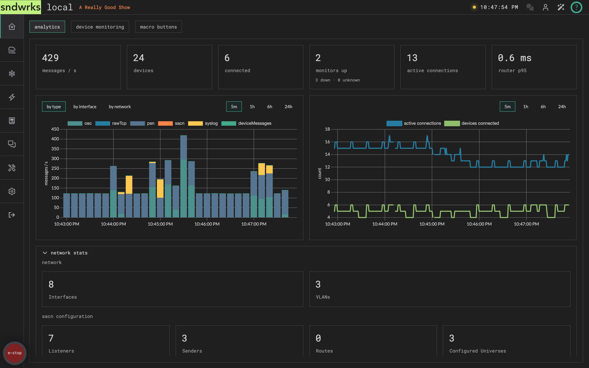
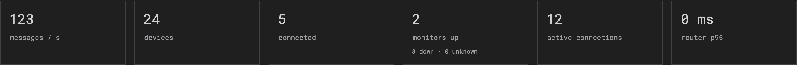
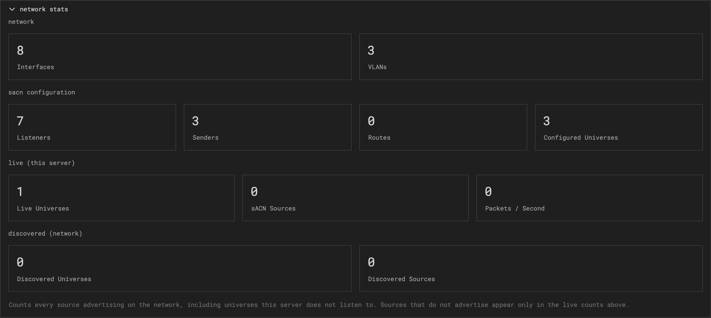
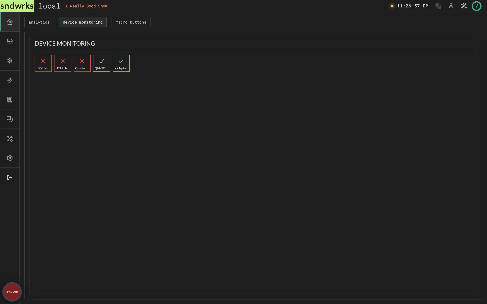
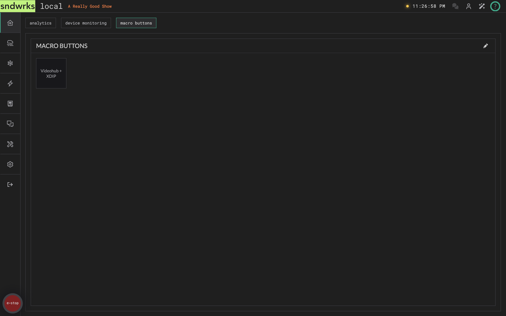
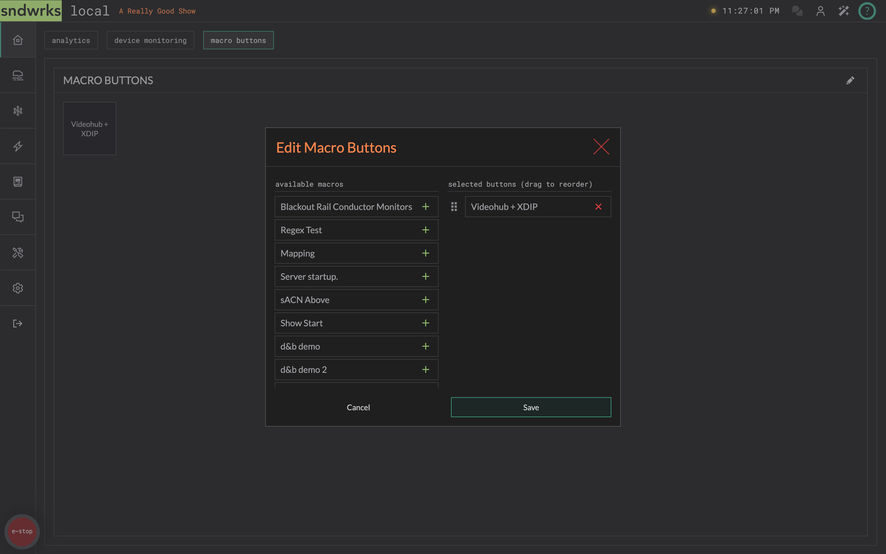

import { Steps, Icon, Aside } from '@astrojs/starlight/components';

The "Hello, and welcome!" page. It's a tabbed dashboard: **analytics**, **device monitoring**, and **macro buttons**.

## Analytics
<Icon name="star" />

Analytics is the first tab, so it's what you land on.

The tiles across the top are live counters: messages per second, device and connection counts, and the router's p95 in/out latency.

Network stats sit below them, broken out per interface.

## Device monitoring
<Icon name="star" />

Devices that have monitoring selected will show up here with their state.

Don't see a device you were expecting? Don't despair. Confirm that monitoring is turned on. [Here's the docs for that](/products/sndwrks-local/software/devices/#monitoring).

## Pin macros to the overview
<Icon name="star" />

The macro buttons tab holds a row of one-tap buttons. Tap a button, the macro fires.

The pencil icon next to the button row opens the **Edit Macro Buttons** modal.

<Steps>

1. Click the pencil icon.
2. In **available macros**, click `+` next to each macro you want pinned.
3. In **selected buttons**, drag rows to reorder, or click `X` to remove.
4. Click **Save**.

</Steps>

Build the macros themselves on the [Macros](/products/sndwrks-local/software/macros) page.
