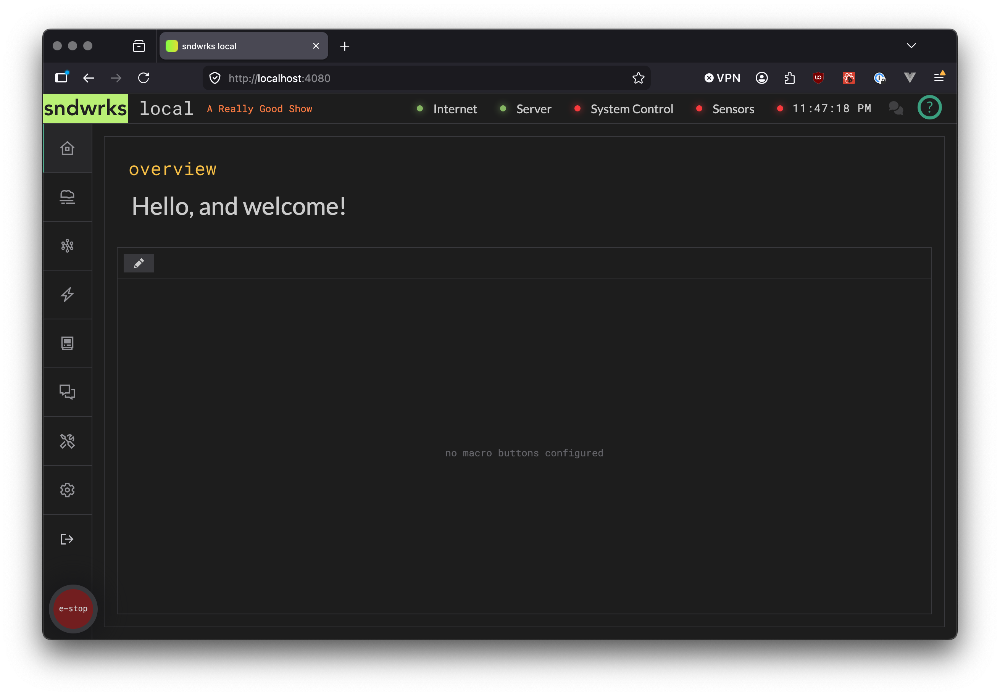
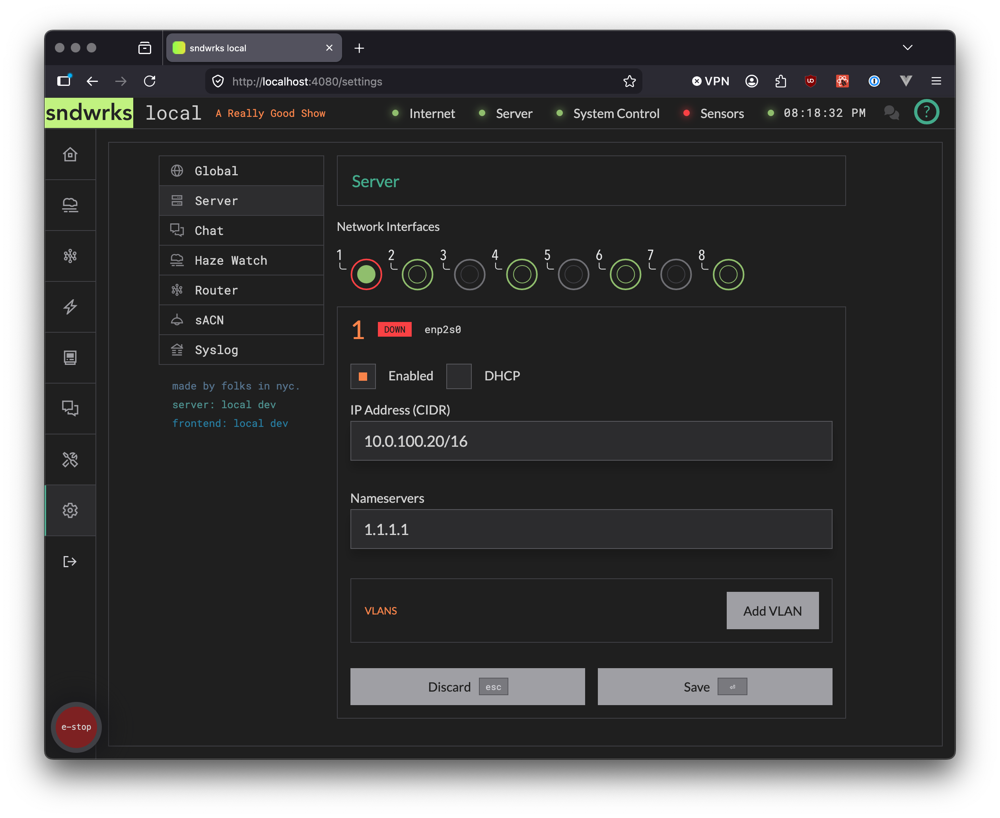
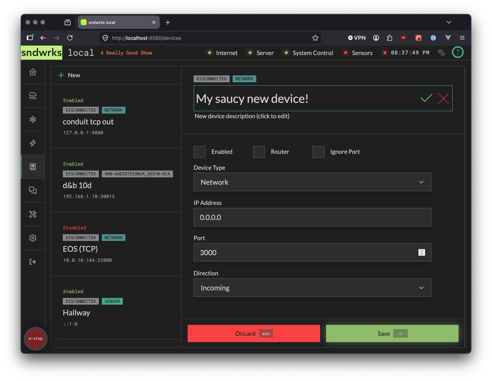
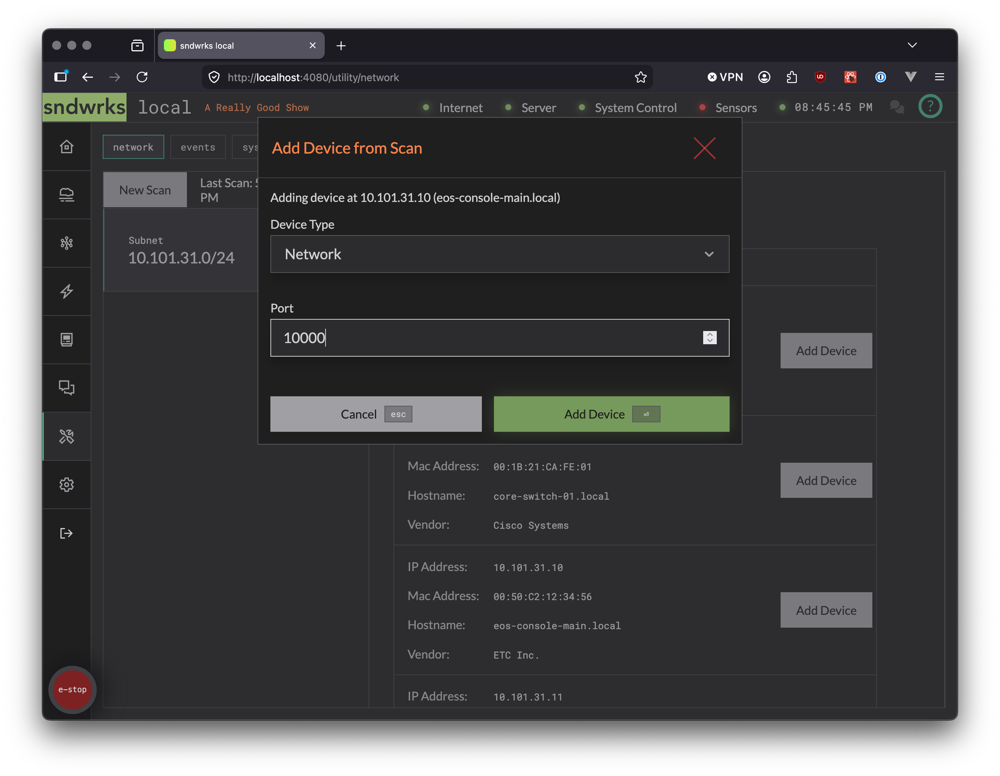

import { Steps, Icon, LinkCard, CardGrid, Tabs, TabItem, Aside } from '@astrojs/starlight/components';

You have a server. We think you may want to know how to get it cooking.

We assume you didn't get into this industry to configure gear, so this guide is intentionally brief. After this, if you have more questions, navigate to the other pages that have deeper dives into each feature.

This guide presumes that you've already done the [hardware setup](/products/sndwrks-local/server-hardware/quick-setup) and powered on.

## Get the App Up
<Icon name="star" />

We'll find the IP address of the server and open the UI in the browser.

<Aside type="note" icon="information">
When you first connect the browser, you'll see a note about the certificate not being trusted. This is because we generate the certificates not a central authority so you can use the server without internet.

Go ahead and tell the browser it's ok to trust the website.
</Aside>

<Steps>
1. **Plug it in**  Hook up `Port 8 (server)` or `Port 2 (smol)` either into your network or directly to a computer.
2. **Find it on the network**  There are two options: Link-local or DHCP. `Link Local` If you don't have DHCP or are plugged in directly, this port has a [link-local address](https://en.wikipedia.org/wiki/Link-local_address) assigned of `169.254.1.1`. If your computer doesn't have a link-local address, set one like `169.254.1.99`. `DHCP`  If you're plugging into the network with DHCP, this port is defaulted to have DHCP enabled and it will (hopefully) an IP address. Use an IP scanner to find the server or look in your DHCP server to see the address.
</Steps>
<Steps>
3. **Open the web app**  Use the IP address from Step 2 (either the DHCP address or `169.254.1.1`) and type that into a browser. 
4. **Celebrate?**  You should see the homepage of the server website. If not, well heck. We'd recommend confirming your computer network settings, cabling, and the address in the browser. If you're still having trouble reach out on [Discord](https://discord.gg/tjPd6Q9A) or our [Contact page](https://www.sndwrks.xyz/contact).
</Steps>

### Server Homepage
<Icon name="star" />

This is close to what you should see. Your url will be different (`http://169.254.1.1` for example)

:::tip
We recommend [Firefox](https://www.firefox.com/en-US/) for various reasons: great privacy, it doesn't use chromium, and it's open-source. 
:::

## IP Address Setup
<Icon name="star" />

Now, let's get the server setup to talk to your network.

We recommend that if you're using DHCP you reserve the IP Address in your DHCP server otherwise just set a static ip address.

<Steps>
1. Navigate to the settings page
2. Select the `Server` panel
3. Select the interface you'd like to configure
4. Add the network options that make sense: DHCP, VLANs etc.
</Steps>

### Network Configuration Page
<Icon name="star" />

## Add a Device (or more)

The devices feature is the core of the software. This is how the server knows what it can communicate with.

There's two ways to add devices.

1. Add manually. We recommend this path if you only want to add one or two devices now.
2. Add from the network scanner. We recommend this path if you have lots of devices.

<Tabs>
  <TabItem label="Add manually">
    <Steps>
      1. Navigate to the devices page
      2. Click `+ New`
      3. Fill out the bits
      4. Hit `Enter` or click `Save`
    </Steps>
    **New Device Page**
    
  </TabItem>
  <TabItem label="Add via network scanner">
    <Steps>
      1. Navigate to the utilities page
      2. Select the `network` tab if not selected
      3. Open the available networks page to add a subnet or add a network to scan
      4. Select your scan speed (see the *disclaimer* about scan speeds there, please don't **Blast** a network that isn't yours. Ask [Cody Spencer](https://www.l-acoustics.com/theartofsound/journal/cody-spencer/) about that one time at the Ahmanson)
      5. Run the scan
      6. Select the subnet you'd like to add devices from if you scanned multiple
      7. Click add devices.
    </Steps>
      **New Device from Scan**
      
  </TabItem>
</Tabs>

## Wrapping Up
<Icon name="star" />

You did it! The server was setup. Hopefully, that was quick. Now you can take the devices you added and do stuff with them like add them to macros or the router.

<CardGrid>
  <LinkCard
    title="Devices"
    icon="star"
    description="The core of the system."
    href="/products/sndwrks-local/software/devices"
  />
  <LinkCard
    title="Macros"
    icon="star"
    description="Control everything."
    href="/products/sndwrks-local/software/macros"
  />
  <LinkCard
    title="Router"
    icon="star"
    description="Wire sources to destinations."
    href="/products/sndwrks-local/software/router"
  />
  <LinkCard
    title="Haze Watch"
    icon="star"
    description="Put a number to the look."
    href="/products/sndwrks-local/software/haze-watch"
  />
  <LinkCard
    title="Utility"
    icon="star"
    description="Little tools to make life easier."
    href="/products/sndwrks-local/software/haze-watch"
  />
</CardGrid>
