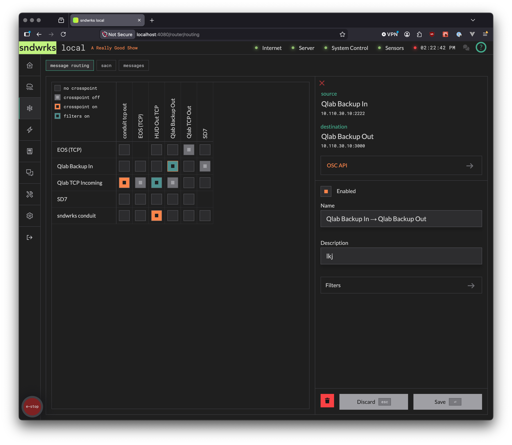
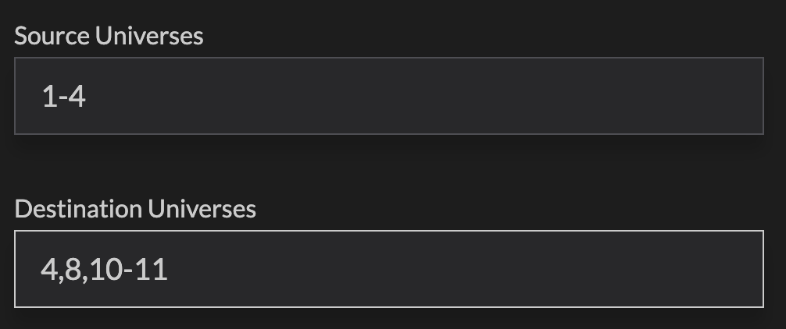

import { Steps, Icon, Aside } from '@astrojs/starlight/components';

The Router feature contains two routers (message routing, sACN), and a message history tab.

This allows the sending of messages from one destination to multiple sources with filters. The router crosspoints can be automated via the [OSC API](/reference/osc-api-v1/).

Message history (messages tab) is an audit trail of *what happened*. 

## Message routing
<Icon name="star" />

The message router sends messages from sources to destinations. This is selectable via the routing matrix.

### Route a message
<Icon name="star" />

<Steps>
1. Click on the crosspoint you want to activate
2. Check **Enabled**
3. Optionally adjust the name and description. We autofill a name like `Qlab Backup In → HUD Out TCP`
4. Add filters if you want them.
5. Press `⏎` to save, or `esc` to discard, or click the buttons there.
</Steps>

### Crosspoints
<Icon name="star" />

This is the heart of the message router.

The crosspoints have four states as indicated in the legend in the top left corner:

- **No Crosspoint**: nothing happening here
- **Crosspoint Off**: this crosspoint exists but is currently not routing anything
- **Crosspoint On**: this crosspoint is actively routing
- **Filters On**: this crosspoint is on AND it has filters

<Aside type="note" icon="information">
Why do we have **No Crosspoint** and **Crosspoint Off**?

**No crosspoint** should be used to indicate this path NEVER routes. **Crosspoint off** should be used to indicate this *may* route. For example, if you were doing a main/backup switch you'd have one route off and one route on, and you'd want to know you setup the off route.
</Aside>

### Crosspoint Filters
<Icon name="star" />

The crosspoint filters allow for only specified messages to be passed along a crosspoint. This is helpful to reduce traffic or only allow needed traffic. You can add multiple filters to further narrow down the subset of messages that are routed. The filters are executed in order.

For example, you may have a lighting console on your network that is spitting out lots of information but you only want go's to end up at another destination.

The filters have 6 options:

- **Includes**: This allows any message that includes the filter pattern. Example: `Includes - 'cue'` would allow `/cue/12` `cuefast` `/a/very/long/address/with/cue` etc.
- **Does Not Include**: The exact opposite of includes. If the filter pattern is anywhere in the message it won't be routed.
- **Matches**: This is like includes but it is an exact match of the filter pattern.
- **Does Not Match**: The opposite of matches.
- **Starts With**: Allows messages that start with the filter pattern. Similar to includes but just a bit more specific.

## sACN routing
<Icon name="star" />

sACN routing is much like message routing. The main difference is it's network interface to network interface and doesn't allow for VLANs to be used.

You can map sACN universes like `1 -> 2` or `1-3,5 -> 5,8,10,14`.

<Aside type="note" icon="information">
The sACN implementation in our server is compliant with ETC sACN.
</Aside>

### Route sACN
<Icon name="star" />

<Steps>
1. Click on the crosspoint you want to activate
2. Check **Enabled**
3. Optionally adjust the name and description. We autofill a name like `1 -> 2`
4. Specify the universes you want to map
5. Optionally, adjust the priority of the forwarded channels
6. Press `⏎` to save, or `esc` to discard, or click the buttons there.
</Steps>

## Messages
<Icon name="star" />

This tab shows all the messages that have been received and sent by the server including [OSC API](/reference/osc-api-v1). The search bar will filter for anything in the messages including bits like OSC arguments.