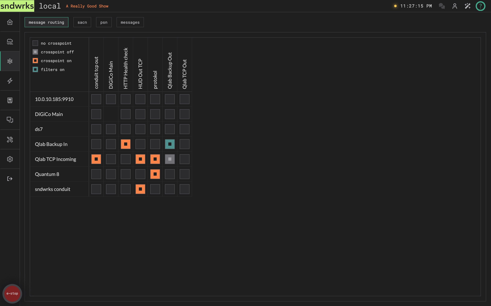
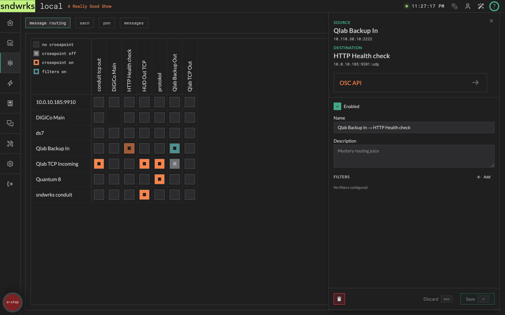
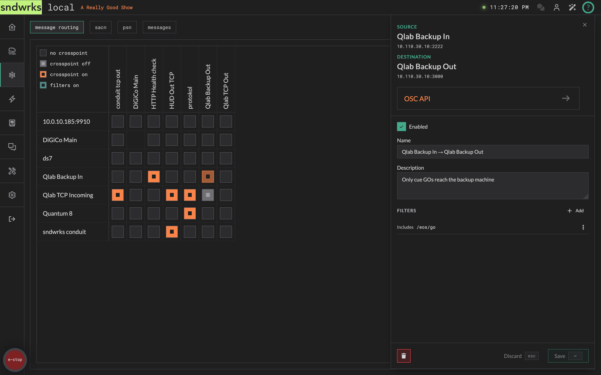
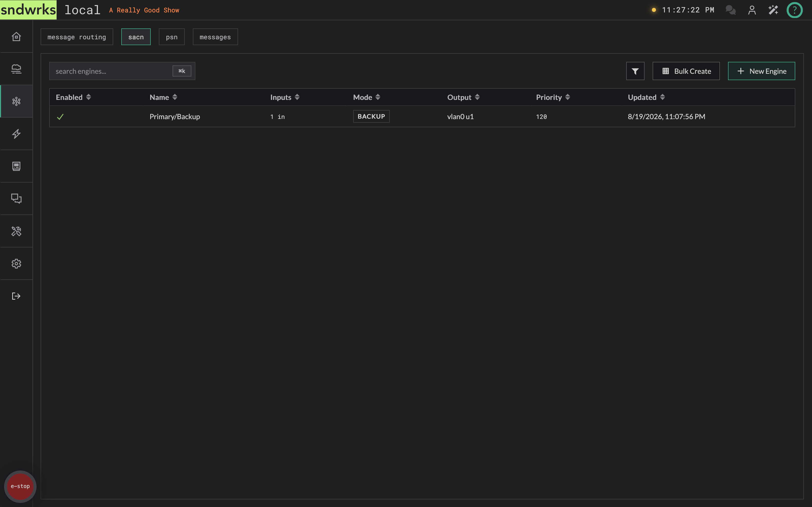
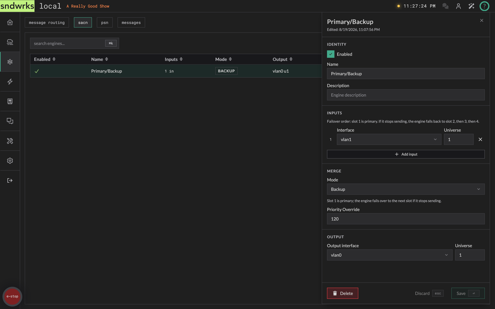
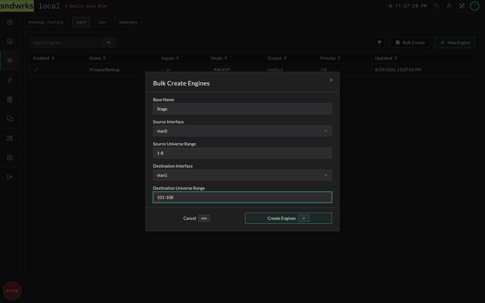
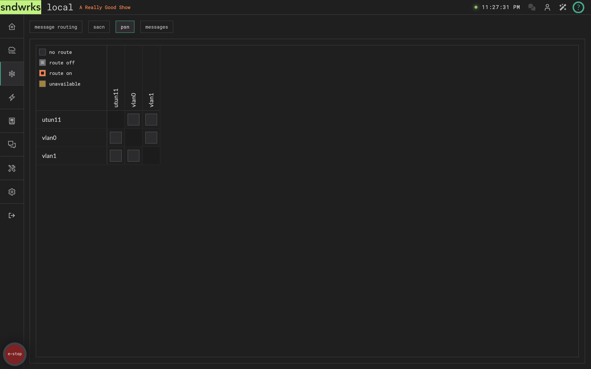
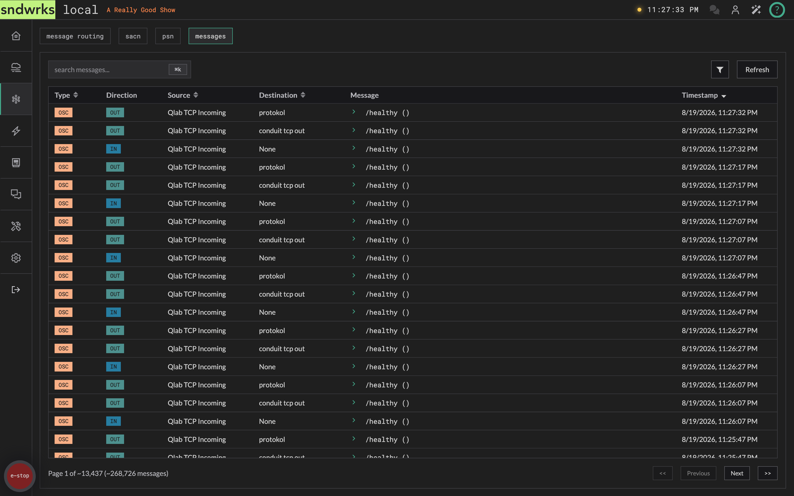

import { Steps, Icon, Aside } from '@astrojs/starlight/components';

The Router feature contains three routers (message routing, sACN, PSN), and a message history tab.

This allows the sending of messages from one destination to multiple sources with filters. The message router crosspoints can be automated via the [OSC API](/reference/osc-api-v1/).

Message history (messages tab) is an audit trail of *what happened*. 

## Message routing
<Icon name="star" />

The message router sends messages from sources to destinations. This is selectable via the routing matrix.

### Route a message
<Icon name="star" />

<Steps>
1. Click on the crosspoint you want to activate
2. Check **Enabled**
3. Optionally adjust the name and description. We autofill a name like `QLab Backup In → HUD Out TCP`
4. Add filters if you want them.
5. Press `⏎` to save, or `esc` to discard, or click the buttons there.
</Steps>

### Crosspoints
<Icon name="star" />

This is the heart of the message router.

The crosspoints have four states as indicated in the legend in the top left corner:

- **No Crosspoint**: nothing happening here
- **Crosspoint Off**: this crosspoint exists but is currently not routing anything
- **Crosspoint On**: this crosspoint is actively routing
- **Filters On**: this crosspoint is on AND it has filters

Clicking a crosspoint opens its editor on the right.

<Aside type="note" icon="information">
Why do we have **No Crosspoint** and **Crosspoint Off**?

**No crosspoint** should be used to indicate this path NEVER routes. **Crosspoint off** should be used to indicate this *may* route. For example, if you were doing a main/backup switch you'd have one route off and one route on, and you'd want to know you setup the off route.
</Aside>

### Crosspoint Filters
<Icon name="star" />

The crosspoint filters allow for only specified messages to be passed along a crosspoint. This is helpful to reduce traffic or only allow needed traffic. You can add multiple filters to further narrow down the subset of messages that are routed. The filters are executed in order.

For example, you may have a lighting console on your network that is spitting out lots of information but you only want go's to end up at another destination.

The filters have 6 options:

- **Includes**: This allows any message that includes the filter pattern. Example: `Includes - 'cue'` would allow `/cue/12` `cuefast` `/a/very/long/address/with/cue` etc.
- **Does Not Include**: The exact opposite of includes. If the filter pattern is anywhere in the message it won't be routed.
- **Matches**: This is like includes but it is an exact match of the filter pattern.
- **Does Not Match**: The opposite of matches.
- **Starts With**: Allows messages that start with the filter pattern. Similar to includes but just a bit more specific.
- **Ends With**: Allows messages that end with the filter pattern.

## sACN routing
<Icon name="star" />

sACN routing is built out of **engines**. An engine takes up to four sACN inputs, merges them with a rule you choose, and sends the result out as a single universe on a single interface.

The sACN tab lists every engine you have built:

| Column | What it shows |
|---|---|
| **Enabled** | A check when the engine is running, a dash when it isn't |
| **Name** | The engine name |
| **Inputs** | How many inputs are attached. Hover it to see each one as `interface u<universe>` |
| **Mode** | The merge mode: HTP, LTP, Priority or Backup |
| **Output** | The output interface and universe. A warning icon appears here if another engine sends to the same interface and universe |
| **Priority** | The priority override, or `—` when there isn't one |
| **Updated** | When the engine was last saved |

Above the table are a search box, a filter button (filter by mode, interface, or enabled state), **Bulk Create**, and **New Engine**. Before you build anything the page reads *No engines yet. Add one to start routing sACN.*

<Aside type="note" icon="information">
The sACN implementation in our server is compliant with ETC sACN.
</Aside>

<Aside type="caution">
Unlike message crosspoints, sACN engines can't be driven from the [OSC API](/reference/osc-api-v1/). They're configured here in the UI.
</Aside>

### Create an engine
<Icon name="star" />

<Steps>
1. Click **New Engine**. The editor opens on a draft called `New Engine`.
2. Under **Identity**, check **Enabled** and give the engine a name and description.
3. Under **Inputs**, click **Add input** and pick an interface and a universe. Add up to **4** inputs — the `×` on the right of a row removes it.
4. Under **Merge**, choose a **Mode**, and set a **Priority Override** if you need one.
5. Under **Output**, pick the interface and universe the merged result goes out on.
6. Press `⏎` to create it, or `esc` to discard, or click the buttons there. On an engine that already exists that button reads **Save**.
</Steps>

An engine with nothing attached reads *No inputs attached. This engine has nothing to route.* and won't save. **Delete** removes an engine, behind a confirmation.

The slot numbers down the left of the inputs are the failover order, and they aren't editable. To reorder inputs, remove them and add them back in the order you want.

### Merge modes
<Icon name="star" />

The mode decides what happens when more than one input is sending to the same engine.

| Mode | What it does |
|---|---|
| **HTP** | Highest Takes Precedence. Per channel, the highest level across every live input wins. Per-address priority is deliberately ignored here — HTP is a level comparison, not a priority scheme. |
| **LTP** | Latest Takes Precedence. The input that most recently *changed* supplies the whole frame. A console idling with unchanged levels does not steal control, no matter how fast it repeats itself. If two inputs change at the same moment, the lower slot keeps it. |
| **Priority** | The input with the highest sACN priority wins, decided per channel. If a source sends per-address priority we use that, otherwise we use the priority on the packet. A per-address priority of `0` means that source isn't sourcing that channel at all. Ties fall back to highest-level between the tied inputs. |
| **Backup** | Slot 1 is primary. If it stops sending, the engine falls to slot 2, then 3, then 4. The winning slot supplies the frame untouched, and the moment slot 1 comes back it takes over again. |

<Aside type="note" icon="information">
Three behaviours that aren't visible on screen:

- An input is considered lost after **2.5 seconds** of silence. That's what triggers a backup failover.
- A source that sends a stream-terminated packet drops out immediately, without waiting out those 2.5 seconds.
- **When the last live input goes away, the engine goes silent — it does not go black.** It sends three stream-terminated packets and then stops transmitting, so whatever is downstream holds its last look instead of snapping to zero.
</Aside>

### Priority override
<Icon name="star" />

Leave **Priority Override** empty and the engine passes along the priority of whichever source won the merge. Set it and every packet the engine sends carries that value instead.

Valid values are `0` to `200`. Note that `0` is a real priority, not the same as leaving the field empty, so an override of `0` is sent as `0`.

### Bulk create engines
<Icon name="star" />

**Bulk Create** builds a run of engines in one go, which is the quick way to forward a block of universes from one interface to another.

<Steps>
1. Click **Bulk Create**.
2. Enter a **Base Name**, like `Stage`.
3. Pick a **Source Interface** and a **Source Universe Range**, like `1-8`.
4. Pick a **Destination Interface** and a **Destination Universe Range**, like `101-108`.
5. Click **Create Engines**.
</Steps>

Ranges take single values, commas and dashes — `1,3-5,8` is valid. Both ranges have to work out to the same number of universes, and one run is capped at **100 engines**.

What you get back is a set of independent, single-input engines named `<base name> <source universe>`. The ranges themselves aren't stored anywhere, so there's no mapping to go back and edit later — from that point on each engine is edited on its own.

### Why won't it save
<Icon name="star" />

The editor blocks a save until:

- The engine has a name.
- It has between **1 and 4** inputs, each with an interface chosen.
- Every universe, input and output, is between **1 and 63999**.
- The priority override is between `0` and `200`, or empty.

Some things that look wrong but are allowed on purpose:

- **Two inputs can point at the same interface and universe.** We collapse them onto one listener behind the scenes.
- **Several engines can output to the same interface and universe.** Sometimes that's what you want, so it shows up as a warning icon on the Output column rather than an error.
- **An engine can input and output on the same interface and universe.** An engine will never re-ingest its own output, but a loop out through another device and back is not something we can stop.

## PSN routing
<Icon name="star" />

PosiStageNet carries live position data for performers, automation, and moving scenery. The PSN tab forwards it between network interfaces using a crosspoint matrix.

There is nothing to merge and nothing to map here. PSN is all-or-nothing per route: whatever tracking data arrives on the source interface goes out the destination.

If you need mapping, you can do that in [macros](/products/sndwrks-local/software/macros/#inputs).

<Aside type="note" icon="information">
If you want a simple way to generate or monitor PSN, you can use our open source app [fake_winch](https://github.com/sndwrks/fake_winch).
</Aside>

### Route PSN
<Icon name="star" />

<Steps>
1. Click the crosspoint where your source interface meets your destination interface.
2. Check **Enabled**.
3. Optionally adjust the name and description. We autofill a name like `Port 3 → Port 5`.
4. Press `⏎` to save, or `esc` to discard, or click the buttons there.
</Steps>

Which interface the server listens on, and on what address and port, is set in [Settings → PSN](/products/sndwrks-local/software/settings). To see what's actually arriving, use the [PSN Monitor](/products/sndwrks-local/software/utility) on the Utility page.

## Messages
<Icon name="star" />

This tab shows all the messages that have been received and sent by the server including [OSC API](/reference/osc-api-v1). The search bar will filter for anything in the messages including bits like OSC arguments.

