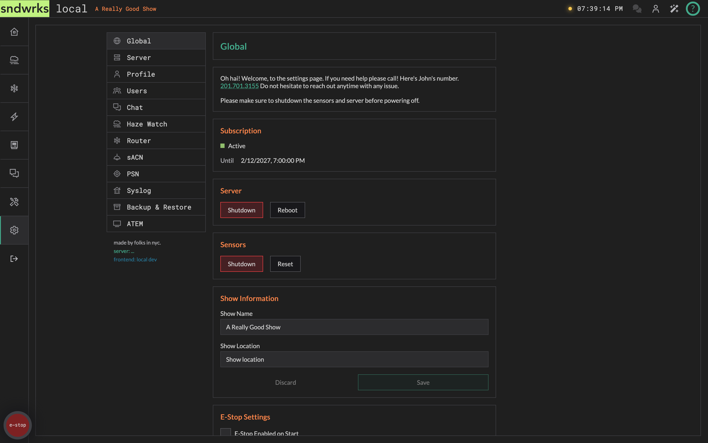
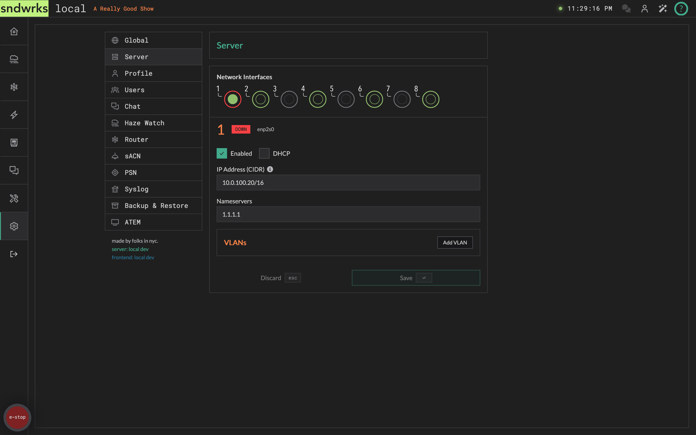
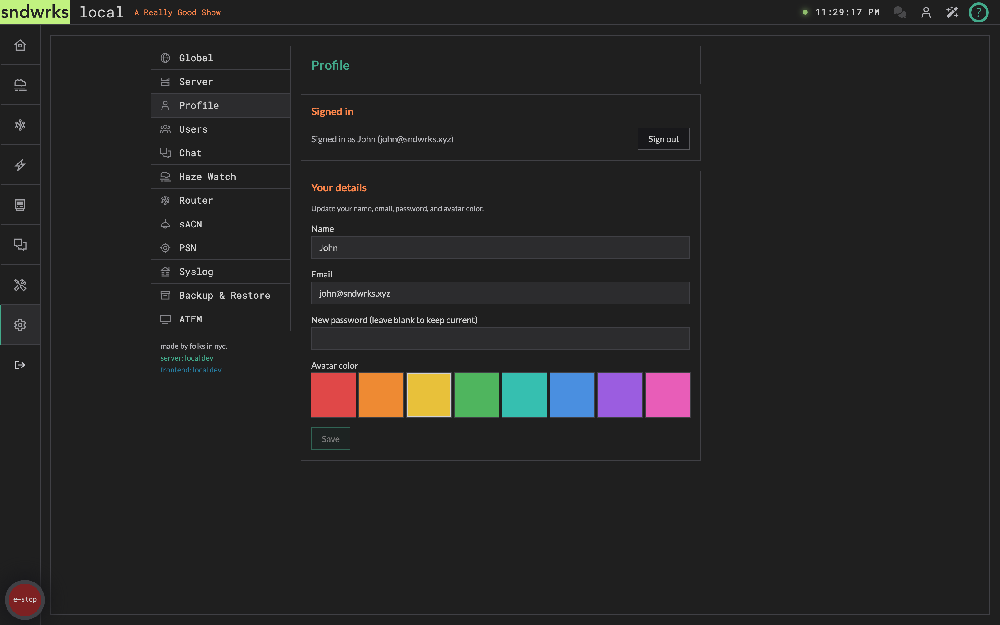
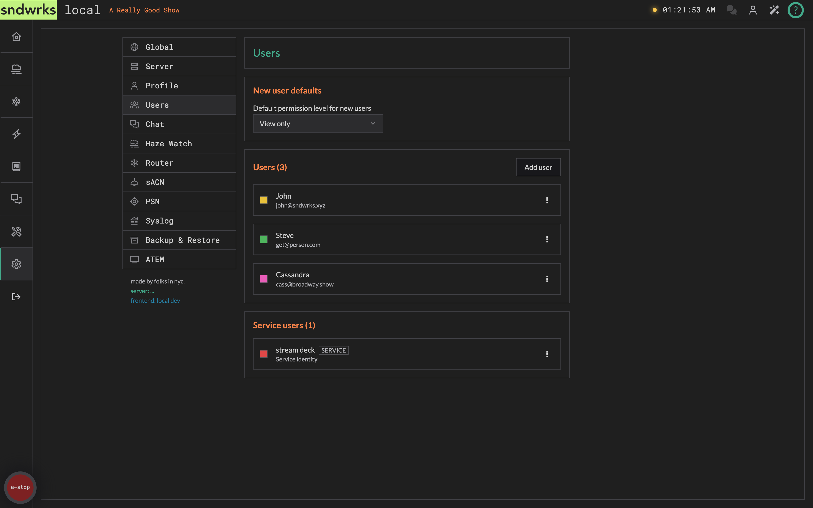
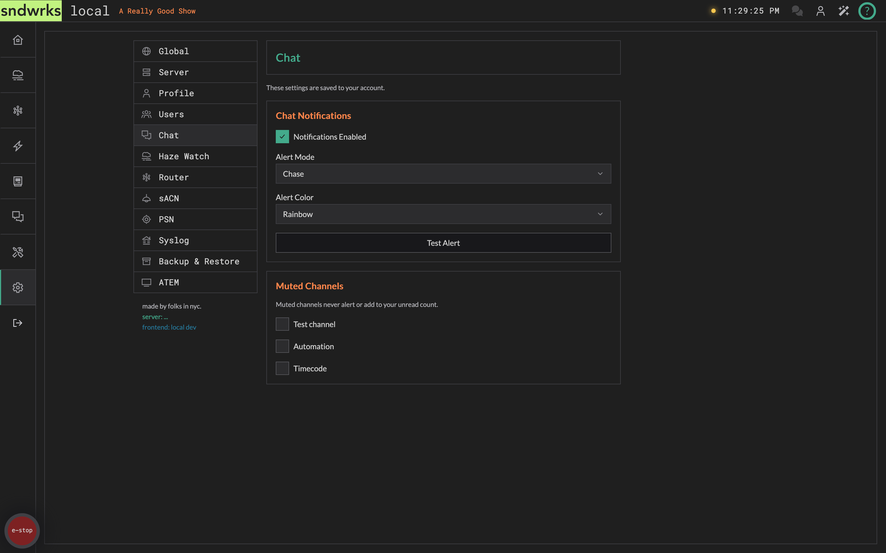
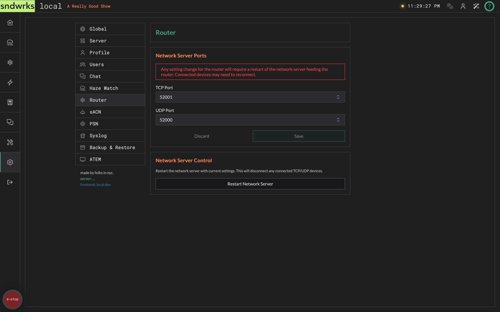
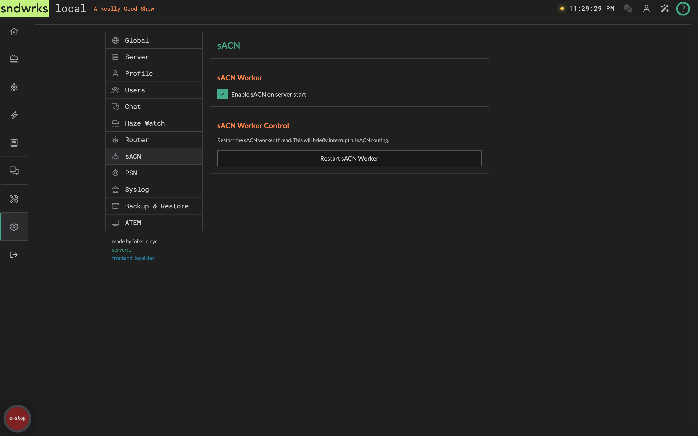
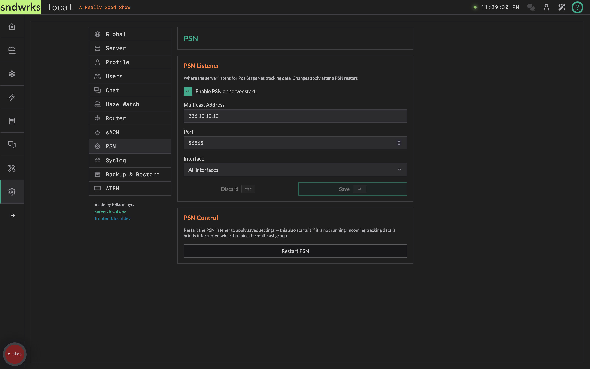
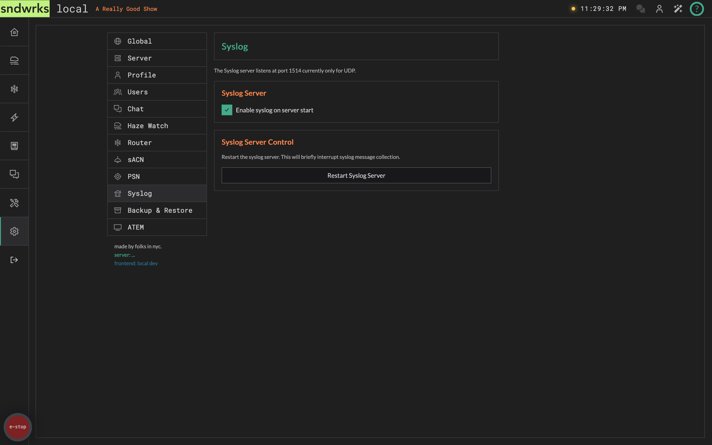
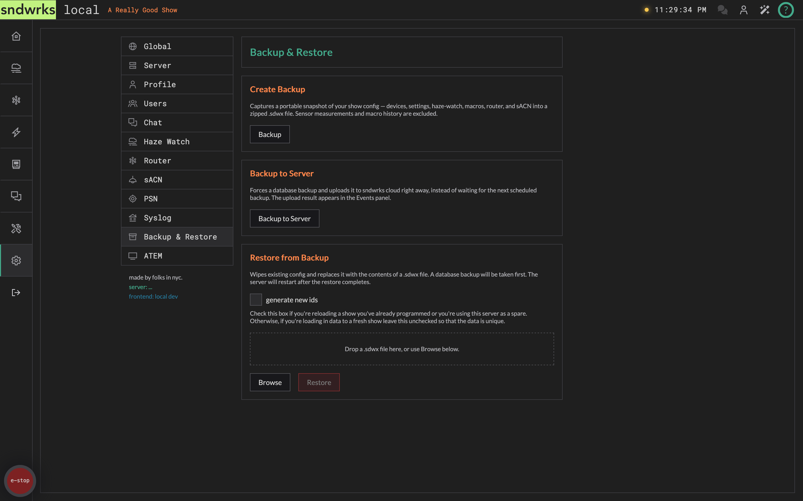

import { Icon, Aside } from '@astrojs/starlight/components';

The settings page is well, ya know, settings. There's various options and actions to manage the server.

## Global
<Icon name="star" />

These are show settings and actions.

### Power/Reset Buttons
<Icon name="star" />

Two cards, each with two buttons.

**Server**

- **Shutdown** — clean shutdown of the server process.
- **Reboot** — restart the host.

**Sensors**

- **Shutdown** — power down haze watch sensors.
- **Reset** — soft restart of the sensors.

<Aside type="caution">
Always shut down sensors and the server before pulling power. Yanking the cord can make the server sad, which will make you sad. Then, we'll be sad because we have to fix it.
</Aside>

### Show Information
<Icon name="star" />

Enter the name of your show and it's location.

### E-Stop Settings
<Icon name="star" />

This checkbox enables E-Stop on server startup. You may want this if you're doing haze control so that the server doesn't try and turn stuff on before you're ready.

For what the e-stop actually stops and who's allowed to press it, see [E-Stop](/products/sndwrks-local/software/e-stop).

### Subscription
<Icon name="star" />

A status light, a label, and the date your server is covered until. See [Cloud](/products/sndwrks-local/software/cloud#subscription) for what each state means.

### Double Message protection
<Icon name="star" />

This drops duplicate OSC messages that are received by the server in a specific timeframe.

<Aside type="tip" logo="pencil">
You may not need to do a main/backup switchover if this setting is enabled. The server will just eat whichever message arrives second, so if a device fails the server is none the wiser and one message still gets through.
</Aside>

### Time Format
<Icon name="star" />

Select *24h* or *12h* as you wish. 

### IP Blocklist
<Icon name="star" />

Sometimes you may not want a device to connect to the server at all. The IP Blocklist drops **show control** traffic from the addresses you list: network server messages (TCP/UDP), the OSC API, macro triggers, syslog, sACN, and PSN.

Add single IPv4 addresses or whole ranges in [CIDR](https://en.wikipedia.org/wiki/Classless_Inter-Domain_Routing) notation like `10.40.20.0/24`. Entries are validated as you type.

<Aside type="note">
The blocklist only affects show control traffic. Your browser talks to the server over a different path, so blocking a subnet won't lock you out of the UI — you can still administer the server from an address you've blocked.
</Aside>

## Server
<Icon name="star" />

Settings related to the server hardware itself specifically network settings.

### Network Settings
<Icon name="star" />

Here is where you set the network information for the server. You can add VLANs, setup DHCP as desired.

The IP addresses with subnets should be entered in as `xxx.xxx.xxx.xxx/xx` a.k.a. [CIDR](https://en.wikipedia.org/wiki/Classless_Inter-Domain_Routing) notation. An example is `10.40.20.8/24` which translates to `10.40.20.8 - 255.255.255.0`.

Select the interface you want to change and then adust the settings and click save!

<Aside type="note">
**Port 8 (server) or Port 2 always has a link local address set `169.254.1.1` in addition to what you set**

Why do we do this? Well, there's nothing worse than when you set the ip address wrong and then all of the sudden you can't access your devices anymore.

This allows you to get back into the server if you oopsie.
</Aside>

## Profile
<Icon name="star" />

Your own account: name, email, password, avatar color, and a sign-out button. See [Users & Permissions](/products/sndwrks-local/software/users-and-permissions) for the full story.

## Users
<Icon name="star" />

Add teammates, set their permissions, and choose what new accounts start with.

## Chat
<Icon name="star" />

These are the settings for chat.

### Chat Notifications
<Icon name="star" />

These are various notifications settings for what happens when you receive a message. We really like the rainbow one so that's the default. These preferences are saved to your account, so they follow you from browser to browser.

## Haze Watch
<Icon name="star" />

There's no settings here!

We'll probably add some stuff here eventually, and wanted to keep the placeholder.

## Router
<Icon name="star" />

The main settings here allow for port control and resetting of network server itself.

### Network Server ports
<Icon name="star" />

You can adjust the ports the server listens on to your heart's content.

The network server portion of the server will restart after the change. You'll need to change the ports your devices use to connect to the server.

We reserve a few ports for sndwrks internal use, and we won't let you set one that we need.

### Network Server Control
<Icon name="star" />

This allows you to just restart the network server. It may be helpful to have your devices reconnect, or just, ya know, turn it off and on again.

## sACN
<Icon name="star" />

These are the various settings related to sACN.

### sACN Worker
<Icon name="star" />

The server has a separate module to handle sACN. You can turn this off if you don't need sACN on your show.

### sACN Worker Control
<Icon name="star" />

Similar to the router network server, you can reset the sACN worker. This may be helpful for various reasons just know that if you hit that button, it's going to interrupt the sACN functionality of the server. 

## PSN
<Icon name="star" />

Settings for [PosiStageNet](/products/sndwrks-local/software/router) tracking data.

### PSN Listener
<Icon name="star" />

Where the server goes looking for PSN:

- **Multicast Address** — the group the tracking system is sending to.
- **Port** — the UDP port to listen on.
- **Interface** — which NIC to listen on. Only interfaces that actually exist on your hardware are offered, so a smol server shows its two ports rather than a full server's eight.

### PSN Control
<Icon name="star" />

Same deal as the sACN and syslog workers: you can stop and restart the PSN listener without touching the rest of the server.

## Syslog
<Icon name="star" />

Here lies the syslog configuration. The syslog server listens on port `1514` for UDP syslog messages.

<Aside type="note" logo="book">
**What's a syslog?**

We're glad you asked! Syslog (short for system logging) is a standardized message format that various devices can send like network switches.

If you have managed switches on your show, there's a good chance they can send syslog messages to the server. This is very helpful to troubleshoot network problems because switches often delete their logs when they shut down.

[Wikipedia Page](https://en.wikipedia.org/wiki/Syslog)
[What is syslog?](https://dev.to/emily_assetloom/what-is-syslog-a-simple-guide-to-understanding-system-logging-4o2e)
</Aside>

### Syslog Server
<Icon name="star" />

Like sACN, you can turn off syslog from running if you don't need it. 

### Syslog Server Control
<Icon name="star" />

This allows you to restart the syslog server. The 'ol turn it off and on again. 

## Backup & Restore
<Icon name="star" />

We figure you may want to save your work, or load a previous state.

The server also automatically creates more comprehensive database backups and uploads them to our servers, but this way you don't have to call us to load another show.

### Create a Backup 
<Icon name="star" />

This takes your show config and zips it into a nice `.sdwx` file. What goes in:

- Devices
- Settings
- Haze watch triggers and commands
- Router destinations and filters
- sACN listeners, senders, and routes
- PSN listeners, senders, and routes
- Macros — triggers, commands, inputs, outputs, transformers, canvas wiring, overview buttons, and email templates

Everything else stays out. That's about size — sensor measurements and macro history can number in the millions — and scope: a show file is your show, not your server.

<Aside type="caution">
**User accounts are not in the `.sdwx` file.** Neither are chat messages, events, or syslog. Restoring a show onto a fresh server gets you your show back, but everyone will still need to sign in or register on that server.
</Aside>

Creating and restoring backups are each permission-gated. The buttons are always visible — they just go dim without the permission, and hovering one names what you need.

### Backup to Server
<Icon name="star" />

Separate from the `.sdwx` show file above. This forces a full database backup and uploads it to sndwrks cloud straight away, rather than waiting for the next scheduled one.

The result lands in the [Events](/products/sndwrks-local/software/utility#events) panel — watch there, not the button. A failed upload doesn't lose anything; the backup is still on your server and the next scheduled one retries.

### Restore from Backup
<Icon name="star" />

This allows you to load a `.sdwx` file you have into the server. Drag and drop or browse for your file to upload. After you've uploaded a file the server will restart to load the information.

There's one option worth understanding before you hit go: **generate new ids**, unchecked by default.

- **Leave it unchecked** to reload a show onto the same server, or to move a programmed show onto a server that will replace the original. Everything keeps the ids it had, so anything pointing at those ids — OSC addresses baked into a console, for instance — still lands.
- **Tick it** when you're loading a show onto a server that you want to be fresh. Maybe you have a setup file that you like, but it's a new show.

If you're not sure, leave it alone. Unchecked is the normal case.

<Aside type="danger">

The server will create a database backup before restore, but know the restore will **overwrite all your settings**!!!

If you accidentally load the wrong file and don't have a backup yourself, you will have to call us to fix it.

</Aside>

## ATEM
<Icon name="star" />

Settings for Blackmagic ATEM switchers. There's one thing in here.

### SuperSource Mask
<Icon name="star" />

A PNG or SVG that floats over the SuperSource editor canvas so you can lay out boxes against real scenic geometry — an LED wall bezel, a projection cut-out, an IMAG hard edge. 512 KB max, one mask per server.

It's a design aid and nothing else. It never reaches the switcher.

Upload, replace, and remove are gated on `settings.atem.superSourceMask.edit`. See [ATEM SuperSource](/products/sndwrks-local/software/atem-supersource#design-against-your-scenery).