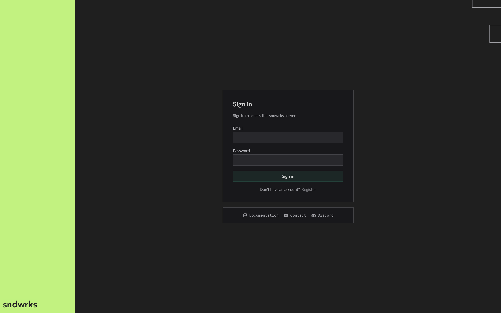
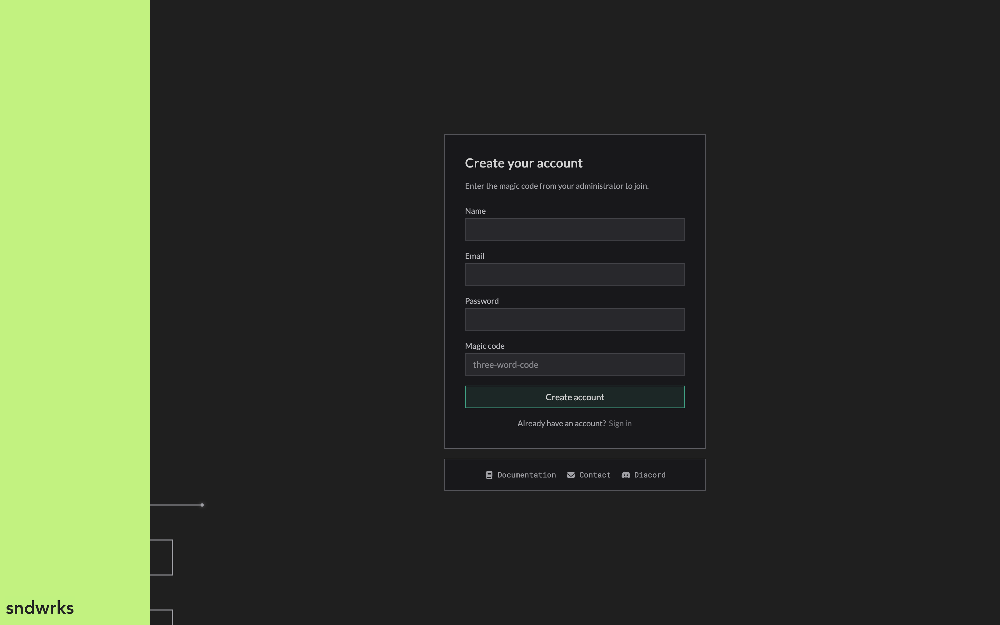
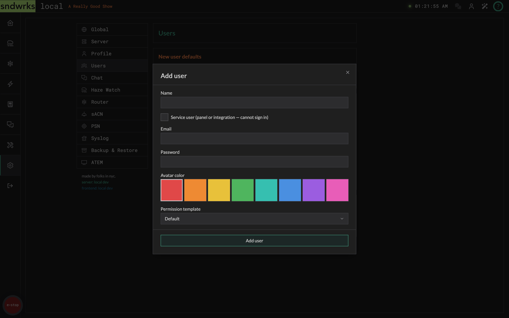
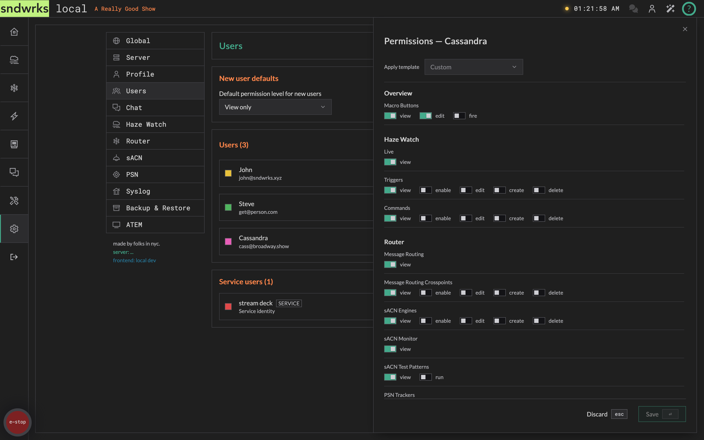

import { Icon, Aside, Steps } from '@astrojs/starlight/components';

The server has accounts. Everyone who uses it signs in, and what each person can see and do is up to you.

Logging in each time can be annoying, but we believe this is a very important feature. Your server can be connected to millions of dollars worth of equipment, and it's important to make sure not just anyone can change things. The permissions tied to user accounts allow you to exercise fine-grained control over who can do what.

We also maintain a sndwrks admin account on each server, so we can always help out when you need it.

## Signing in
<Icon name="star" />

When you open the app you'll meet the sign-in screen before anything else. Enter your email and password and you're in.

Sessions stick around for about 30 days, so you won't be typing your password every show. If someone fat-fingers the password too many times in a row, that IP gets a short cooldown before it can try again. Basically the server is saying "easy there tiger" (probably).

## Creating an account
<Icon name="star" />

Don't have an account yet? Click **Register** and fill out your name, email, password (8 characters or more), and a **magic code**.

The magic code is a short three-word phrase. This code is in your system dashboard in the [cloud app](https://app.sndwrks.com). 

<Aside type="caution">
The magic code is a shared secret. Anyone who has it can create an account on your server, so treat it like the key to the shop and only hand it to people you want on the system.
</Aside>

<Aside type="note">
A server can be installed with no magic code at all, which switches self-registration off entirely. On one of those, **Register** won't get you anywhere and an admin has to create your account for you.

If you require more security, let us know and we can set that up for you.
</Aside>

## Your profile
<Icon name="star" />

Head to **Settings → Profile** to manage yourself. This panel is always available to you, no matter your permissions.

Here you can update your name, email, password (leave it blank to keep your current one), and your avatar color. There's also a **Sign out** button.

## Managing users
<Icon name="star" />

**Settings → Users** is where admins add and manage the team. You'll need the users permission to see it.

You won't be able to delete the sndwrks admin account, and you won't be able to delete the last account.

### New user defaults
<Icon name="star" />

Pick the permission level that new accounts start with: **Full**, **Enable only**, or **View only**. This is what someone gets the moment they register, so set it to the most restrictive level that makes sense for your show and grant more from there.

We recommend using [least privilege](https://en.wikipedia.org/wiki/Principle_of_least_privilege) here. Give users only the access they need and no more.

### Add a user
<Icon name="star" />

<Steps>
1. Click **Add user**.
2. Enter their name, email, and a starting password.
3. Pick an avatar color.
4. Choose a permission template.
5. Click **Add user** to save.
</Steps>

The **Full Access** template is only available if you already hold full permissions yourself. That keeps folks from granting more than they have.

## Permissions
<Icon name="star" />

Permissions decide what each person can see and do, section by section, right down to individual actions.

### Templates
<Icon name="star" />

Templates are quick starting points:

- **Full** — can do everything.
- **Enable only** — can view and toggle things on and off, but not create, edit, or delete.
- **View only** — can look, but not touch.

When you're *adding* a user there's a fourth choice, **Default**, which hands them whatever you set as the new-user default. It's only on the add-user form — once an account exists, the permission editor offers the three real templates.

<Aside type="note">
**View only** deliberately holds one thing back: the ability to view the user list. That page shows everyone's email, so it's never granted by a template — an admin has to turn it on by hand.
</Aside>

### The permission editor
<Icon name="star" />

Open a user and you'll get a per-action editor grouped by section: Overview, Haze Watch, Router, Macros, Devices, Chat, Utility, and Settings. Each group has toggles like *view*, *enable*, *edit*, *create*, and *delete* (plus a few action-specific ones like *fire* a macro button or *run* a scan).

Toggles cascade. Turning on a higher-level action pulls in the ones below it, so granting *edit* also gives *view*. The **Apply template** dropdown flips every toggle to a preset at once; if you then tweak anything by hand it shows as **Custom**.

<Aside type="caution">
If you lower your **own** permissions, we'll ask you to confirm first. It's surprisingly easy to remove your own access to user management and lock yourself out.
</Aside>

### When you're missing a permission
<Icon name="star" />

You never get a blank screen or a mystery failure. What you get depends on what's being gated:

- **Buttons stay put and go dim.** Hover one and a tooltip names exactly what you're missing — *"You need the Haze Watch Triggers Edit permission."* Nothing moves around, so the layout you learned yesterday is the layout you get today.
- **Panels show a lock.** A settings panel you can't view opens to a small padlock and the same message, naming the permission to ask for.
- **Tabs and menu entries disappear.** Nav entries, page tabs, and the items in a row's **⋮** menu are simply absent rather than dimmed — there'd be nothing to hover.

So a greyed-out button means "ask someone for this", and a missing tab means "this isn't part of your job on this show".
