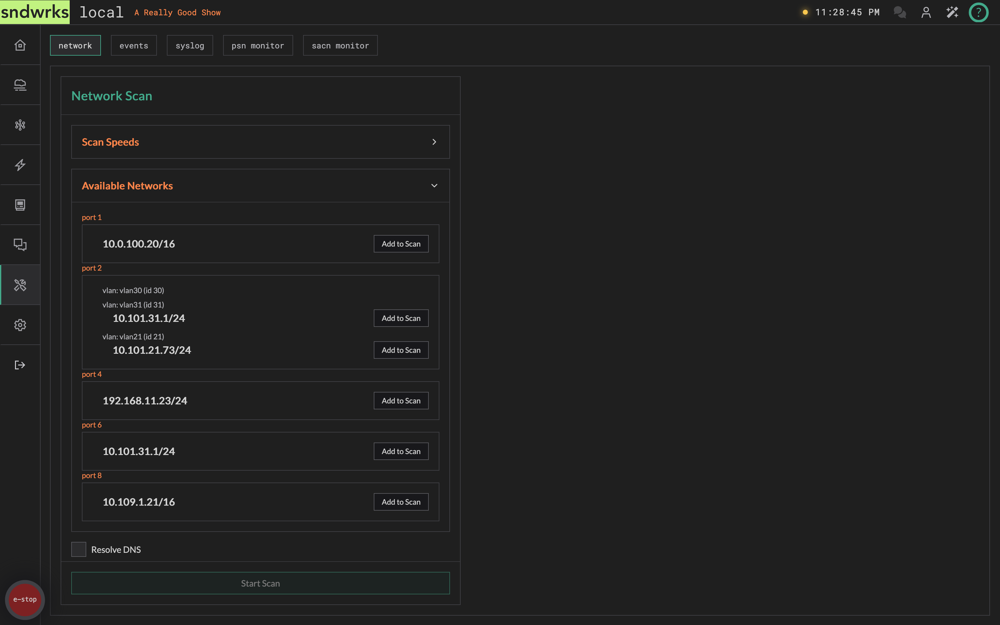
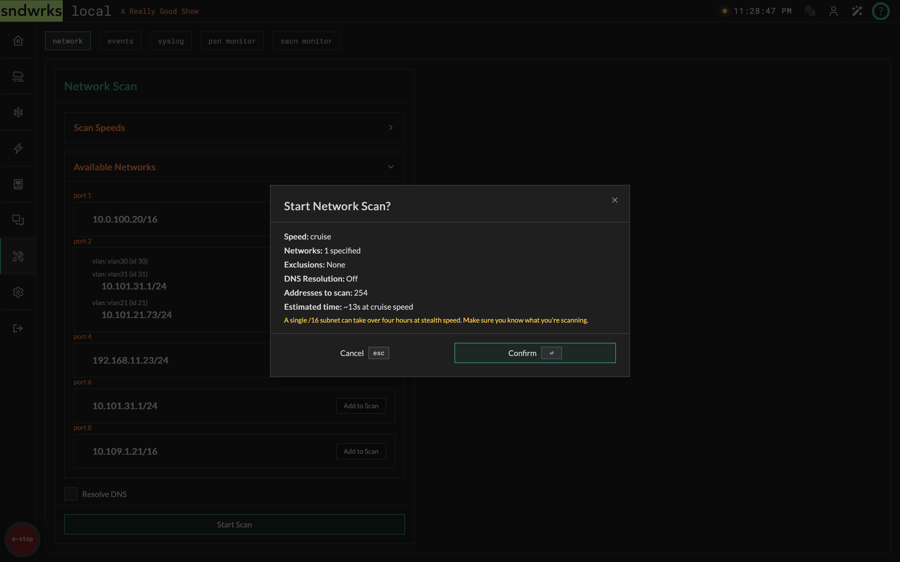
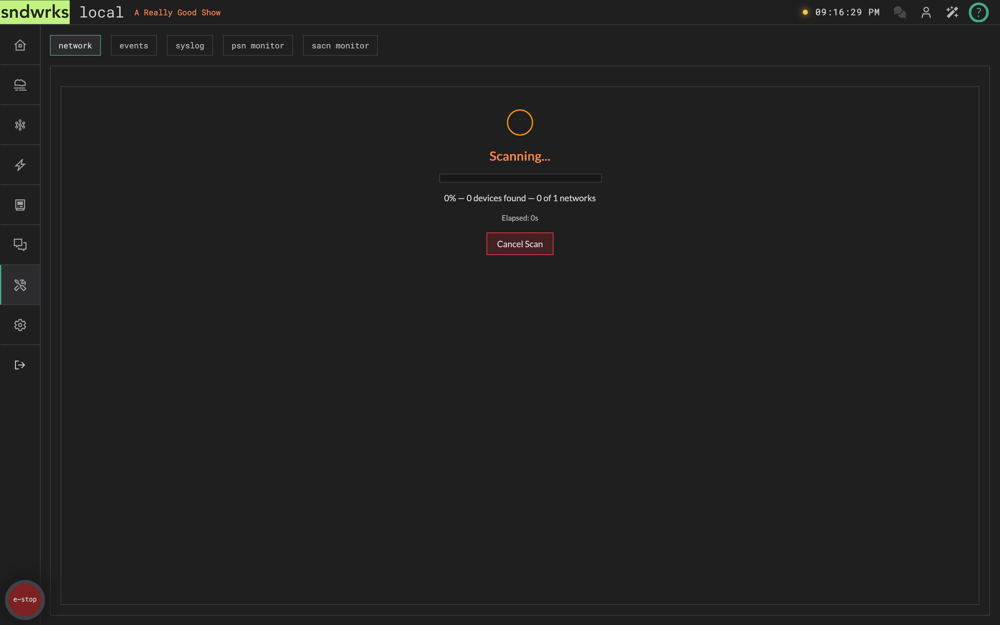
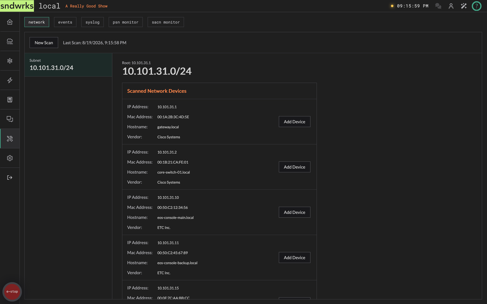
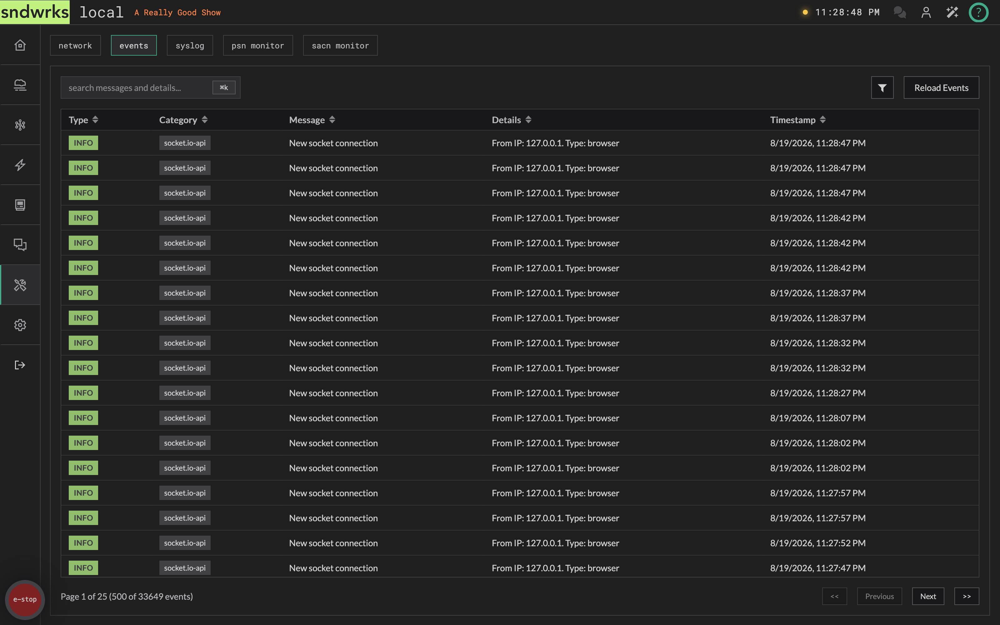
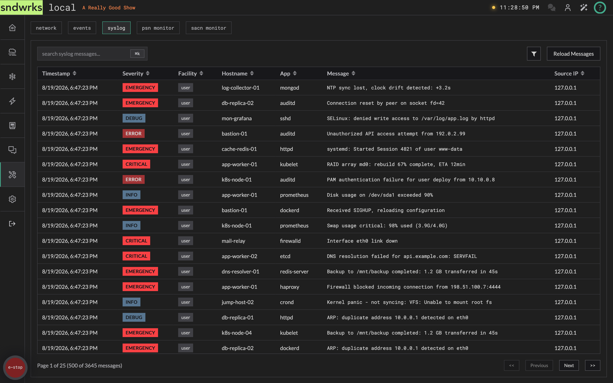
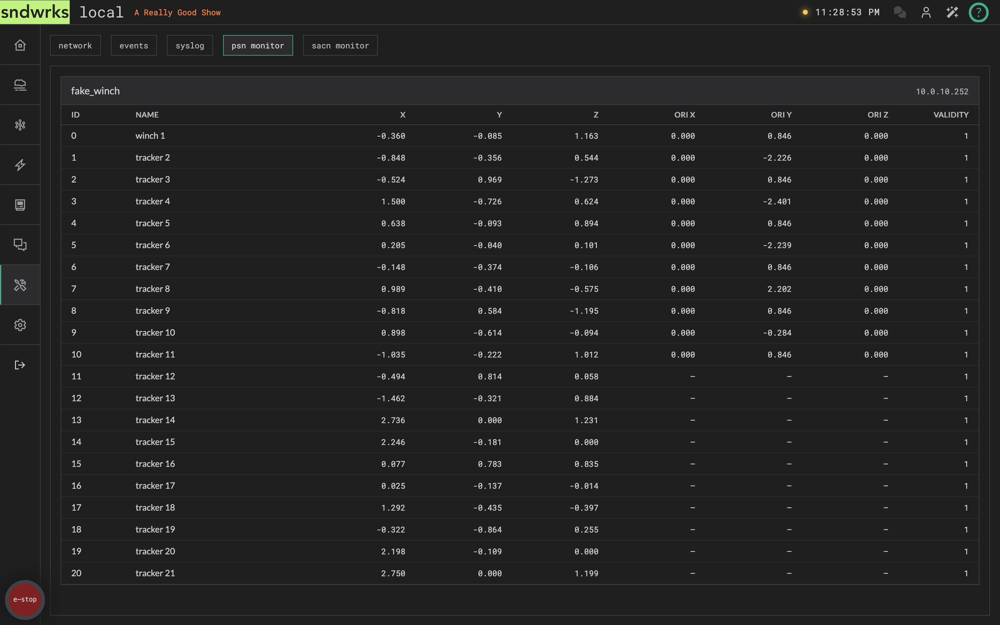
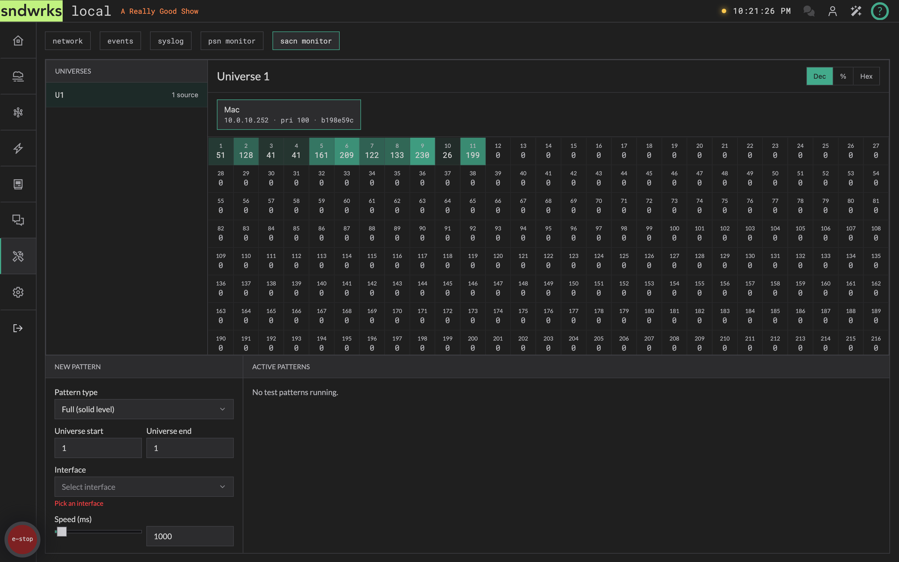

import { Steps, Icon, Aside } from '@astrojs/starlight/components';

Ah yes, the utility page. This is a bunch of assorted pieces that will smooth your show experience.

It's split into tabs: **Network**, **Events**, **Syslog**, **PSN Monitor**, and **sACN Monitor**.

## Network
<Icon name="star" />

This is the built-in network scanner.

The IP addresses with subnets should be entered in as `xxx.xxx.xxx.xxx/xx` a.k.a. [CIDR](https://en.wikipedia.org/wiki/Classless_Inter-Domain_Routing) notation. An example is `10.40.20.8/24`.

<Aside type="caution">
Prefixes shorter than `/16` are rejected. A `/8` is 16 million addresses and you would be scanning until your show closes.

We will say if you have a network with millions of addresses call us.
</Aside>

### Scan speeds
<Icon name="star" />

Open the **Scan Speeds** accordion and the app will tell you this too, but here it is in writing:

| Speed | Rate | When |
|---|---|---|
| `stealth` | ~5 packets/sec | Slow, but unlikely to cause network disruptions. |
| `cruise` | ~20 packets/sec | Balanced speed and safety. Safe for most networks. |
| `blast` | ~500 packets/sec | It's called blast for a reason. Don't do this during a show. Don't use this option on networks you don't control. |

### Run a scan
<Icon name="star" />

Here's how to run a network scan.

<Steps>
1. Note the various scan speeds and their consequences.
2. Optionally, open the available networks accordion and select which subnets you want to scan. Otherwise, you can just type an address into the include list.
3. Choose a scan speed. (did you read about the different speeds?)
4. Add other subnets, or optionally exclude subnets you don't want to scan.
5. Tick **Resolve DNS** if you want hostnames looked up along the way. It's a little slower, but the hostname gets prefilled when you turn a result into a device.
6. Click scan! You'll get a **Start Network Scan?** summary first — speed, how many networks, how many exclusions, DNS on or off, the total number of addresses, and roughly how long it'll take. Read the estimate before you confirm.
7. While it runs you'll see progress, a device count, and a **Cancel Scan** button if you need to stop early.
8. Results land in the endpoints card. Use the found devices to quickly add them into the server.
</Steps>

Step 6 gives you a summary to read before anything goes out on the wire.

Step 7, while it runs:

And step 8, what you get back:

Running a scan is permission-gated. The scan button doesn't vanish if you lack it — it just goes dim, and hovering it names the [permission](/products/sndwrks-local/software/users-and-permissions) you need.

## Events
<Icon name="star" />

This is all the events the server has had happen to it. You may not need to get in here all that often, but it's helpful to troubleshoot like when did this device last connect or did this macro error.

## Syslog
<Icon name="star" />

The server's syslog messages it has received. You can search or filter for various messages here.

We find this helpful when diagnosing a network issue like ports going up and down or spanning tree elections.

## PSN Monitor
<Icon name="star" />

A live look at the [PosiStageNet](/products/sndwrks-local/software/router) tracking data arriving at the server. Trackers are grouped by the system sending them, with the system name and source IP in the header.

Each tracker row gives you its ID, name, position (**X**, **Y**, **Z**), orientation (**Ori X**, **Ori Y**, **Ori Z**), and a validity figure.

If nothing's arriving you'll get a plain "No PSN trackers are currently being received".

## sACN Monitor
<Icon name="star" />

The same idea for sACN, whether or not you've routed any of it.

While the monitor is open the server listens across universes 1–256 and joins each one's multicast group on every interface. That means sources show up here even if they never advertise themselves through discovery and nothing is routed to them — which is usually exactly what you want when something isn't arriving and you're trying to work out who's actually transmitting.

<Steps>
1. Pick a universe from the list on the left. Each row shows how many sources it's hearing.
2. Pick a source. You'll see its name, IP, priority, and a short CID — handy when two consoles are fighting over the same universe.
3. Read the DMX grid. Toggle the values between **decimal**, **percent**, and **hex** with the buttons in the header.
</Steps>

